## 一、显微镜

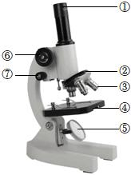

1. 显微镜的结构

① 是!!目镜!!，没有螺纹，目镜越短，放大倍数越!!大!!

② 是转换器，可以安装和转换!!物镜!!

③ 是!!物镜!!，有螺纹，物镜越长，放大倍数越!!大!!

④ 是!!遮光器!!， 光线较暗时，用!!大光圈!! ，光线较强时，用!!小光圈!!

⑤ 是!!反光镜!!， 光线较暗时，用!!平面镜!! ，光线较强时，用!!凹面镜!!

⑥ 是!!粗准焦螺旋!!，!!大幅度!!调节镜筒的升降，可以!!快速找到物像!!

⑦ 是!!细准焦螺旋!!，!!小幅度!!调节镜筒的升降，可以!!使物像更清晰!!

2. 显微镜的使用：取镜与安放 → 对光 → 观察 → 整理

① 取镜与安放：一托一握

② 对光：转动粗准焦螺旋使镜筒!!上升!!→ 转动转换器，换用!!低倍!!物镜 → 转动遮光器，使用!!较大光圈!!→ 注释目镜 → 转动反光镜 → 直到视野中出现!!明亮光斑!!

③ 调焦：顺时针转动粗准焦螺旋使镜筒!!下降!!，直到从!!侧面!!观察物镜靠近玻片 → 转动粗准焦螺旋使镜筒!!上升!!直至视野中出现!!清晰物像!! → 转动细准焦螺旋使物像!!更清晰!!

④ 整理：将显微镜归位

## 二、制作动、植物细胞临时装片

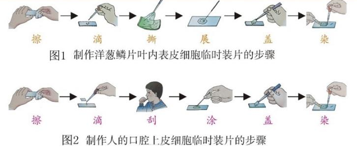

1. 制作洋葱鳞片叶内表皮细胞临时装片的步骤：
   - 擦 → 滴（!!清水!!）→ 撕 → 展 → 盖 → 染（!!碘液!!）→ 吸。
2. 制作人体口腔上皮细胞临时装片的步骤
   - 擦 → 滴（!!生理盐水!!）→ 漱 → 刮 → 涂 → 盖 → 染（!!稀碘液!!）→ 吸
3. 滴加生理盐水的目的：!!维持细胞的正常形态!!。
4. 用凉开水漱口的原目的是：!!除去食物残渣，防止干扰实验!!。
5. 盖盖玻片时要先使它的一边先接触液滴，然后缓缓地盖上，目的是!!防止产生气泡!!。
6. 染色的目的是!!可以清晰的观察物像!!。
7. 用吸水纸吸的目的是!!使染色更均匀!!。

## 三、动物和植物的细胞结构

1. 动、植物细胞都有的结构：
   - ②!!细胞膜!!（!!控制物质进出!!）；
   - ④!!细胞核!!（内含!!遗传物质!!）；
   - ⑥!!细胞质!!；
   - ⑦!!线粒体!!（能够进行!!呼吸!!作用）。
2. 植物细胞特有的结构：
   - ①!!细胞壁!!（保护和支持细胞）；
   - ③!!叶绿体!!（能够进行!!光合!!作用，将!!光!!能转化成!!化学!!能）；
   - ⑤!!液泡!!（含有!!细胞液!!，溶解着多种物质）。

## 四、动植物细胞的分裂过程

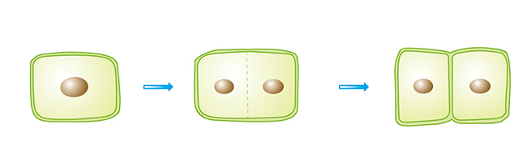
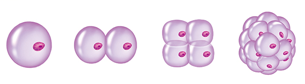

1. 细胞分裂过程：
   - 细胞分裂是指!!一个细胞分裂成两个细胞的过程!!。
   - ① 植物细胞：在原来的细胞中央，形成新的!!细胞膜!!和!!细胞壁!!。
   - ② 动物细胞：!!细胞膜!!从细胞的中部向内凹陷，缢裂为两个细胞。
2. 在细胞分裂过程中，!!染色体!!的变化最明显：染色体会先进行!!复制!!；再!!平均分配!!，分别进入两个!!新细胞中!!。所以新细胞与原细胞的!!染色体形态和数目!!相同，所含遗传物质也!!相同!!。

## 五、细胞生长、分裂和分化示意图

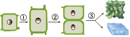

1. 生物体由小长大的原因：
   - ① 细胞!!生长!!：使细胞体积增大；
   - ② 细胞!!分裂!!：使细胞数目增多；
   - ③ 细胞!!分化!!：形成组织。
2. 细胞生长、细胞分裂和细胞分化后，遗传物质!!没有!!发生改变。

## 六、单细胞草履虫的结构

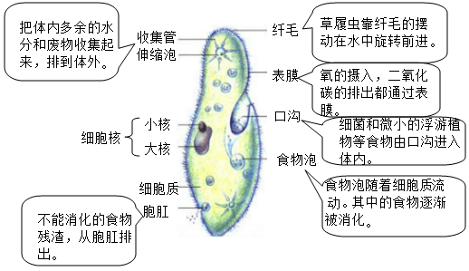

1. 草履虫的结构和功能
   - ① 收集管和伸缩泡：把体内多余的!!水分!!和!!废物!!收集起来，通过!!表膜!!排到体外。
   - ② 小核：控制生物的遗传。
   - ③ 大核：与生物的营养有关。
   - ④ 细胞质。
   - ⑤!!胞肛!!：排出食物残渣。
   - ⑥!!纤毛!!：运动。
   - ⑦ 表膜：氧的摄入，二氧化碳的排出都通过表膜，相当于!!细胞膜!!。
   - ⑧!!口沟!!：摄食。
   - ⑨!!食物泡!!：消化。
2. 草履虫的通过!!分裂!!产生新个体。
3. 观察草履虫应从培养液的!!表层!!（含氧多）吸一滴培养液制成标本，在低倍镜下观察，在玻片中的培养液中放几丝棉花纤维，目的是!!避免草履虫运动过快，影响观察!!。

## 七、细菌

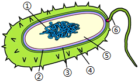

1. 根据细菌的形态，可以将细菌分为!!球菌、杆菌和螺旋菌!!。
2. 细菌都是!!单细胞!!的，细菌的细胞结构由
   - ③!!细胞壁!!、
   - ②!!细胞膜!!、
   - ⑤!!细胞质!!、
   - ①DNA 集中区，
   - 个别细菌有
     - ④!!荚膜!!和
     - ⑥!!鞭毛!!（用于!!运动!!），
   - 细菌没有!!成形的细胞核!!，属于!!原核生物!!。
3. 细菌靠!!分裂!!生殖，遇不良环境，!!细胞壁!!增厚，形成休眠体—!!芽孢!!。
4. 细菌没有!!叶绿体!!，大多数细菌营养方式为!!异养!!。

## 八、单细胞真菌---酵母菌

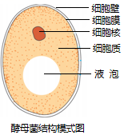

1. 酵母菌的结构包括!!细胞壁、细胞膜、细胞核、细胞质、液泡!!构成，具有!!成形的细胞核!!，被称为!!真核生物!!。
2. 酵母菌生殖方式一般为：!!出芽生殖!!，当环境恶劣时会变成!!孢子!!生殖。
3. 酵母菌由于没有叶绿体，营养方式为!!异养!!。

## 九、病毒的结构

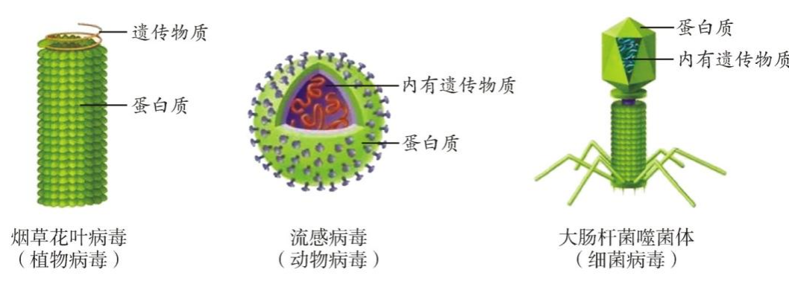

1. 病毒的结构简单，没有!!细胞结构!!，只由!!蛋白质外壳和内部的遗传物质!!组成。
2. 病毒不能独立生活，只能!!寄生!!在其它生物的!!活细胞!!内，根据寄主细胞的不同，可以分为!!动物病毒、植物病毒、细菌病毒（噬菌体）!!。
3. 生殖：!!自我复制!!，靠自己遗传物质中的遗传信息，利用!!细胞!!内的营养物质，制造出新的病毒。

## 十、生态系统

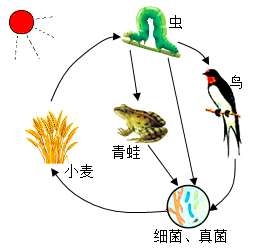

1. 概念：在一定的空间范围内，!!生物!!与!!环境!!所形成的统一的整体。
2. 生态系统的组成
   - !!生物!!部分
     - !!生产者!!：绿色植物等
     - !!消费者!!：动物等
     - !!分解者!!：腐生细菌、真菌等
   - !!非生物!!部分：阳光、空气、水等

## 十一、食物链和食物网

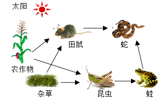

1. 食物链的起点!!生产者!!，终点是!!最高级消费者!!。
2. 食物链只包括!!生产者!!和!!消费者!!，没有!!分解者!!和!!非生物部分!!。
3. 食物链中的箭头表示!!物质!!和!!能量!!的流动方向。
4. 箭头由被捕食者指向捕食者，如草 → 兔 → 狐。

## 十二、物质循环和能量流动

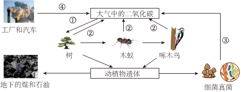

1. 碳进入生物群落的途径：①!!绿色植物的光合作用!!；
2. 碳进入无机自然环境的途径：②!!动植物的呼吸作用!!；③!!微生物的分解作用!!（分解者能将动植物遗体种的有机物分解成!!水、无机盐和二氧化碳!!等无机物）；④!!化石燃料的燃烧!!；
3. 碳在无机环境和生物群落之间主要是以!!二氧化碳!!的形式进行循环；
4. 碳在生物群落之间主要是以!!含碳有机物!!的形式进行传递；
5. 能量流动的特点：!!单向流动，逐级递减!!。

## 十三、种子的结构

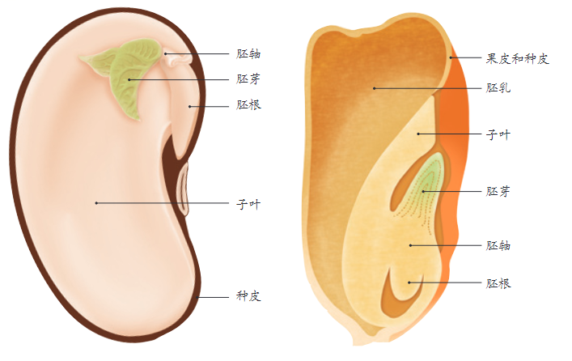

1. 菜豆种子
   - 种皮：保护种子内部结构
   - !!胚芽!!：将来发育成茎和叶
   - !!胚轴!!：将来发育成连接根和茎的部分
   - 胚根：将来发育成!!根!!
   - 子叶：!!2!!片，!!储存!!营养
2. 玉米种子
   - 种皮和果皮：保护果实种子内部结构
   - 胚
     - !!胚芽!!：将来发育成茎和叶
     - !!胚轴!!：将来发育成连接根和茎的部分
     - 胚根：将来发育成!!根!!
     - 子叶：!!1!!片，!!转运!!营养
       !!胚乳!!：储存营养
3. !!胚!!是新植物的幼体，由!!胚芽、胚轴、胚根、子叶!!组成。
4. 双子叶植物：有 2 片子叶，一般无!!胚乳!!，!!子叶!!贮存营养。食用部分主要是!!子叶!!。
5. 单子叶植物：有 1 片子叶,有!!胚乳!!，!!胚乳!!贮存营养，!!子叶!!转运营养。食用部分主要是!!胚乳!!。

## 十四、根尖的结构

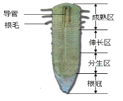

1. 根尖的结构和功能
   - ①!!成熟区!!：形成导管和根毛，是根吸收水分和无机的主要部位；
   - ②!!伸长区!!：根生长最快的的部位；
   - ③!!分生区!!：不断分裂产生新细胞；
   - ④!!根冠!!：具有保护作用。
2. 根的生长主要靠!!分生区!!细胞分裂增加细胞的数量和!!伸长区!!增大细胞的体积。

## 十五、木本植物茎的结构

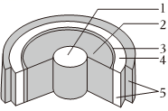

1. 木本植物茎的结构由外向内依次为 5!!树皮!!（包括表皮和 4!!韧皮部!!）、3!!形成层!!、2!!木质部!!和 1!!髓!!。
2. 木质部中的!!导管!!可以!!自下而上!!运输!!水分和无机盐!!；
3. 韧皮部种的!!筛管!!可以!!自上而下!!运输!!有机物!!；
4. 在木质部和韧皮部之间有!!形成层!!，形成层细胞不断分裂使茎!!不断长粗!!。

## 十六、叶芽的结构

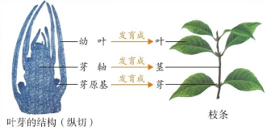

1. 枝条的发育：植物的万千枝条及绿叶都是由!!芽!!发育成的。
2. 叶芽的结构：枝条由!!芽!!发育而成，其中的!!幼叶!!发育成叶，!!芽轴!!发育成茎，!!!!发育芽原基成芽。

## 十七、花的结构

图甲中 A 雌蕊，B 雄蕊，① 柱头，② 花柱，③ 子房壁，④ 胚珠，⑤ 子房，⑥ 花药，⑦ 花丝。

1. 花的主要结构是 A!!雌蕊!!和 B!!雄蕊!!。
   - 雌蕊由 ①!!柱头!!、②!!花柱!!和 ⑤!!子房!!组成，
   - 雄蕊由 ⑥!!花药!!和 ⑦!!花丝!!组成。
2. 花药上面有!!花粉!!，花粉里面有!!精子!!。
   - 子房包括 ③!!子房壁!!和 ④!!胚珠!!，
   - 胚珠里面有!!卵细胞!!。

## 十八、传粉、受精以及果实和种子的形成

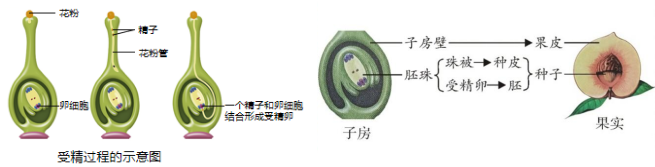

1. 一朵花要结出果实，必须经过!!传粉!!和!!受精!!两个生理过程。
2. 传粉：花粉从!!花药!!中散放而落到!!雌蕊!!柱头上的过程。
3. 受精：花粉落到雌蕊柱头上以后，在柱头黏液的刺激下萌发出!!花粉管!!。花粉管穿过花柱，进入!!子房!!,一直到达!!胚珠!!。而后花粉管中的!!精子!!与胚珠中的!!卵细胞!!结合形成!!受精卵!!的过程。
4. 果实和种子的形成：
   - 子房
     - 子房壁 → !!果皮!!
     - 胚珠
     - 珠被 → !!种皮!!
     - 卵细胞＋精子 → 受精卵 → !!胚!!
     - 极核＋精子 → 受精极核 → !!胚乳!!

## 十九、植物嫁接的过程

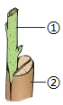

1. 嫁接是把一株植物体的芽或带芽的枝接到另一株植物体上，使它们愈合成一株完整的植物体。
   - 图中，① 是!!接穗!!、② 是!!砧木!!。
2. 嫁接成功的关键是：!!接穗和砧木的形成层要紧密贴合在一起!!。

## 二十、叶片的结构

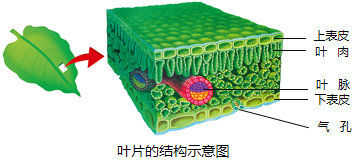

1. 叶片由!!表皮!!、!!叶肉!!和!!叶脉!!组成。
2. 表皮
   - ① 上表皮和下表皮：没有叶绿体，起保护作用，属于!!保护!!组织。
   - ② 保卫细胞：围成!!气孔!!，内含叶绿体。
   - ③ 气孔：既是植物蒸腾作用的“!!门户!!”， 又是气体交换的“!!窗口!!”。
3. 叶肉
   - 属于!!营养!!组织，含有叶绿体，是光合作用的场所。
4. 叶脉
   - 内有!!导（筛）管!!和!!机械组织!!，起输导和支撑作用，属于输导组织。

## 二十一、绿叶在光下制造有机物

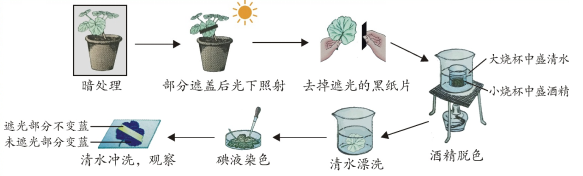

1. 实验步骤：暗处理 → 遮光并光照 → 去掉黑纸片 → 水浴加热 → 漂洗滴碘 → 冲洗观察。
2. 暗处理：先把盆栽的天竺葵放到黑暗处一昼夜。目的是!!消耗叶片中原有的淀粉!!。
3. 实验现象: 叶片的见光部分滴加碘液后变成!!蓝色!!。  叶片的遮光部分滴加碘液后!!不变蓝!!。
4. 实验结论: ①!!淀粉!!是光合作用的产物。 ②!!光!!是绿叶制造有机物不可缺少的条件。

## 二十二、绿色植物的三大作用

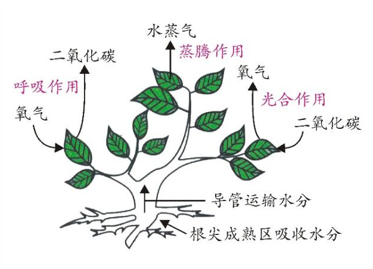

1. 蒸腾作用
   - ① 水分从活的植物体表面以!!水蒸气!!状态散失到大气中的过程。主要通过!!叶片!!进行。
   - ② 意义：促进!!水分!!的吸收,拉动!!水!!和!!无机盐!!在植物体内的运输。降低叶片表面的!!温度!!，避免被灼伤。
2. 光合作用
   - ① 原料：!!水、二氧化碳!!。
   - ② 产物：!!有机物、氧气!!。
   - ③ 主要场所：!!叶绿体!!。
   - ④ 条件：!!光!!。
   - ⑤ 实质：合成!!有机物!!，储存!!能量!!。
   - ⑥ 文字表达式: 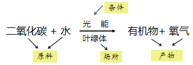。
   - ⑦ 意义：提供食物，氧气来源、维持 平衡。
   - ⑧ 应用：
     - ① 延长光照时间
     - ② 增大光照强度
     - ③ 适当提高二氧化碳浓度。
3. 呼吸作用
   - ① 原料：!!有机物、氧气!!。
   - ② 产物：!!水、二氧化碳!!。
   - ③ 主要场所：!!线粒体!!。
   - ④ 条件：活细胞。
   - ⑤ 实质：分解!!有机物!!，释放!!能量!!。
   - ⑥ 表达式：!!有机物+氧气 → 二氧化碳+水+能量!!。
   - ⑦ 意义：为生物体的生命活动提供!!能量!!。
   - ⑧ 低温、低水、低氧、高二氧化碳。

## 二十三、消化系统结构图

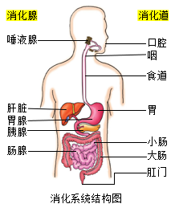

1. 人体的消化系统是由!!消化道!!和!!消化腺!!组成的。
2. 消化道由上到下依次是：
   - ① 口腔：牙齿咀嚼磨碎食物；舌的搅拌，使食物与唾液混合。
   - ② 咽和食道：食物的通道，没有消化作用。
   - ③ 胃：并初步消化蛋白质。
   - ④ 小肠：!!消化和吸收!! 的主要场所。
   - ⑤ 大肠：通过蠕动，将食物残渣推向肛门。
   - ⑥ 肛门：粪便排出体外的出口。
3. 消化腺：
   - ① 唾液腺：分泌!!唾液!!（通过导管流入口腔），唾液淀粉酶能初步消化淀粉。
   - ② 胃腺：分泌!!胃液!!，胃蛋白酶能初步消化蛋白质。
   - ③ 肠腺：分泌!!肠液!!，能消化糖类、蛋白质和脂肪。
   - ④ 胰腺：分泌!!胰液!!，能消化糖类、蛋白质和脂肪。
   - ⑤ 肝脏：分泌!!胆汁!!，不含消化酶，能乳化脂肪。
4. 具有消化功能的器官：!!口腔，胃，小肠!!
5. 具有吸收功能的器官：!!胃，小肠；大肠!!

## 二十四、三大营养物质的消化

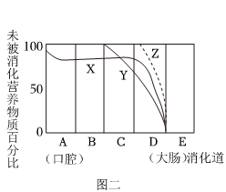

1. 图中：A 代表!!口腔!!，B 代表!!咽和喉!!，C 代表!!胃!!，D 代表!!小肠!!，E 代表!!大肠!!，X 代表!!淀粉!!，Y 代表!!蛋白质!!，Z 代表!!脂肪!!，
2. 淀粉的消化：起始于!!口腔!! ，在!!唾液!!（消化液）的作用下被分解成!!麦芽糖!!；终止于!!小肠!!，在!!肠液!!、!!胰液!!（消化液）的作用下被分解成!!葡萄糖!! 。
3. 蛋白质的消化：起始于!!胃!!,在!!胃液!!（消化液）的作用下被分解成!!多肽!!；终止于!!小肠!!，在!!肠液!!、!!胰液!!（消化液）的作用下被分解成!!氨基酸!!。
4. 脂肪的消化：起始于!!小肠!!、在!!胆汁!!（一种消化液，不含消化酶）的作用下被分解成!!脂肪微粒!!；终止于!!小肠!!，在此处分解为!!甘油!!和!!脂肪酸!!。

## 二十五、小肠的结构

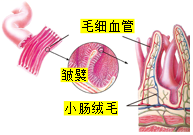

1. 消化和吸收的主要场所：!!小肠!!。
2. 小肠的结构特点与其功能相适应：
   - ① 长：小肠很长。（增大了小肠的!!消化!!和!!吸收!!的面积）
   - ② 大：小肠内表面有!!皱襞!!和!!小肠绒毛!!。（增大了!!消化!!和!!吸收!!的面积）
   - ③ 薄：小肠绒毛壁和毛细血管壁都是由一层!!上皮细胞!! 构成。（薄，有利于营养物质的!!吸收!! ）
   - ④ 多：小肠内有多种!!消化液!!。（有胆汁、胰液、肠液，有利于食物的!!消化!!）。

## 二十六、平衡膳食宝塔

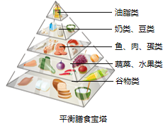

1. 合理营养是指!!全面!!而!!平衡!!的营养。
2. 早、中、晚餐的能量应当分别占!!30％!!、!!40％!!、!!30％!!，三餐应该按时。

## 二十七、呼吸系统的组成

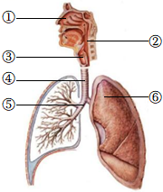

1. 人体的呼吸系统是由!!呼吸道!! 、!!肺!!组成的。
2. 呼吸道包括!!① 鼻 →② 咽 →③ 喉 →④ 器官 →⑤ 支气管!!（请用图中的数字加结构名称回答），功能是!!清洁、温暖、湿润空气!!。
3. 肺的功能的!!进行气体交换!!，肺泡适合气体交换的原因是!!肺泡数量多、肺泡外包绕着毛细血管、肺泡壁和毛细血管壁都很薄，只由一层上皮细胞构成!! 。

## 二十八、呼吸运动

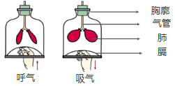

1. 呼气：膈肌和肋间肌!!舒张!!，膈顶部!!上升!!，肋骨!!下降!!，胸廓容积!!缩小!!，肺!!收缩!!，肺内气压!!大于!!外界气压。
2. 吸气：膈肌和肋间肌!!收缩!!，膈顶部!!下降!!，肋骨!!上升!!，胸廓容积!!扩大!!，肺!!扩张!!，肺内气压!!小于!!外界气压。

## 二十九、气体交换的类型

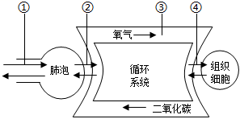

1. 如图，气体交换的类型有
   - ①!!肺与外界的气体交换!!、
   - ②!!肺泡处的气体交换!!、
   - ④!!组织细胞处的气体交换!!，其中
     - ① 气体交换的方式是!!呼吸作用!!，
     - ②④ 气体交换的方式是!!气体扩散!!。
2. ② 气体交换结果是!!静脉!!血变成!!动脉!!血；③ 气体交换结果是!!动脉!!血变成!!静脉!!血。

## 三十、血液的组成

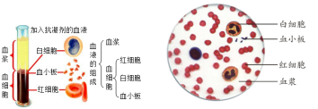

1. 血液是由!!血浆!!（55%）和!!血细胞!!（45%）组成的。
2. 血浆：① 运载!!血细胞!!；② 运输人体生命活动所需的!!物质!!和体内产生的!!废物!!。
3. 血细胞：包括!!红细胞!!、!!白细胞!!和!!血小板!!。
   - ① 红细胞：成熟红细胞没有细胞核，两面凹，数量最多，含血红蛋白，运输!!氧!!。
   - ② 白细胞：有!!细胞核!!，体积最大，作用是!!吞噬病菌!!。
   - ③ 血小板：无细胞核，体积小，形状不规则，作用是!!止血和加速凝血!! 。

## 三十一、三种血管的关系示意图

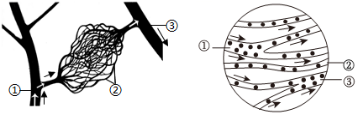

1. 血管分为三类：①!!动脉!!，②!!毛细血管!!，③!!静脉!!；
2. 动脉管壁较!!厚!!、弹性!!大!!，血流速度!!最快!!，主要是将血液从心脏输送到身体各部分；
3. 静脉管壁较!!薄!!、弹性!!小!!，血流速度!!较慢!!，主要是将血液从身体各部分送回到心脏；
4. 毛细血管，管壁!!最薄!!，只由一层扁平上皮细胞构成，管的内径十分小，只允许!!红细胞单行通过!!。血流速度!!最慢!!，是连通于最小的动脉和静脉，便于血液与组织细胞充分地!!进行物质交换!!。

## 三十二、心脏的结构

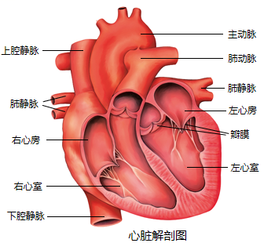

1. 心脏四个腔分别是!!左心房!!、!!左心室!!、!!右心房!!、!!右心室!!。
2. 心脏壁主要由!!肌肉!!组织（心肌）构成。
3. !!左心室!!最厚，输送血液的距离最远。
4. 瓣膜作用：防止血液倒流。
   - ① 心房和心室之间有!!房室瓣!!：朝向!!心室!!开，血液只能从!!心房!!流向!!心室!!。
   - ② 心室和动脉之间有!!动脉瓣!!：朝向!!动脉!!开，血液只能从!!心室!!流向!!动脉!!。
   - ③ 心脏左侧血液流动方向：!!肺静脉!!→ 左心房 → 左心室 →!!主动脉!!。(流!!动脉!!血)
   - ④ 心脏右侧血液流动方向：!!上、下腔静脉!!→ 右心房 → 右心室 →!!肺动脉!!。（流!!静脉!!血）。

## 三十三、心脏工作示意图

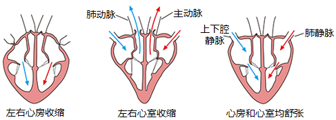

1. 左右心房收缩，血液从!!心房!!流向!!心室!!，房室瓣!!打开!!，动脉瓣!!关闭!!。
2. 左右心室收缩，血液从!!心室!!流向!!动脉!!，房室瓣!!关闭!!，动脉瓣!!打开!!。
3. 心室和心房均舒张，血液从!!静脉!!流向!!心房!!，房室瓣!!打开!!，动脉瓣!!关闭!!。

## 三十四、血液循环的途径

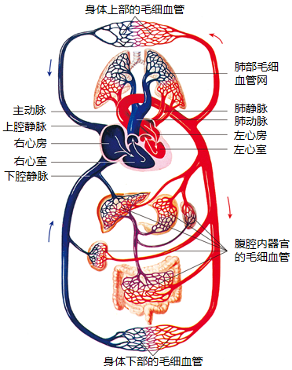

1. 体循环：!!左心室!!→ 主动脉 → 各级动脉 → 全身毛细血管网 → 各级静脉 → 上、下腔静脉 →!!右心房!!。由!!动脉!!血变为!!静脉!!血。
2. 肺循环：!!右心室!!→ 肺动脉 → 肺部的毛细血管网 →!!肺静脉!!→!!左心房!!。由!!静脉!!血变成!!动脉!!血。

## 三十五、泌尿系统的组成

- ① 是!!肾脏!!——形成尿液；
- ② 是!!膀胱!!——输送尿液；
- ③ 是!!输尿管!!——暂时贮存尿液；
- ④ 是!!尿道!!——排出尿液。

## 三十六、肾脏的内部结构

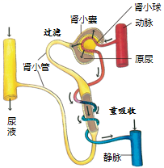

1. !!肾单位!!是肾脏结构和功能的基本单位，肾单位包括!!肾小球!!、!!肾小囊!!、!!肾小管!!。 
2. 肾小球和肾小囊内壁起!!过滤!!作用：当血液流经肾小球时，除!!血细胞和大分子的蛋白质!! 以外，血浆中的一部分水、无机盐、葡萄糖和尿素等物质都可以经过肾小球过滤到肾小囊中，形成!!原尿!!。 
3. 肾小管的!!重吸收!!作用：原尿流经肾小管，全部!!葡萄糖!!、大部分的!!水!!和部分!!无机盐!!等被肾小管重新吸收。

## 三十七、神经系统的组成

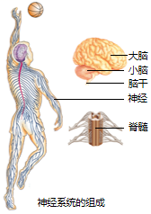
1. 神经系统包括!!中区神经系统!!和!!周围神经系统!! ； 
2. 中枢神经系统分为!!脑!!和!!脊髓!!；
3. 脑：分为!!大脑、小脑和脑干!!：!!大脑皮层!!是最高级神经中枢，具有语言、视觉、听觉、运动中枢；小脑的功能是!!维持身体平衡!!；脑干的功能是!!心跳和呼吸!!中枢，称为“!!活命中枢!!”； 
4. 脊髓：可以完成一些基本的反射活动，如!!膝跳反射!!、排便反射，同时也可以接受刺激，产生兴奋并传导兴奋。

## 三十七、神经元

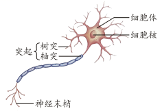

1. 神经元：又叫神经细胞，包括!!细胞体!!和!!突起!!，是构成神经系统结构和功能的基本单位。

## 三十八、反射弧

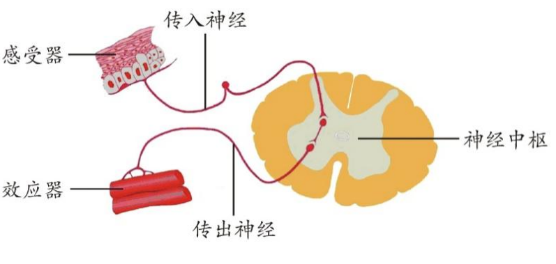

1. 神经调节的基本方式是!!反射!!，反射的结构基础是!!反射弧!!。
2. 反射弧由!!感受器、传入神经、神经中枢、传出神经、效应器!!组成。
3. 感受器、传入神经、神经中枢受损，则!!无感觉，无反应!!。
4. 传出神经和效应器受损，则!!有感觉，无反应!!。

## 三十九、眼球的结构

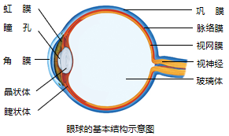
1. 眼球的结构
   - 眼球
      - 眼球壁
         - 外膜
         - 中膜
         - 内膜
      - 内容物
         - 房水
         - 晶状体
         - 玻璃体
2. 视觉形成的过程：外界光线 →!!角膜!!→!!瞳孔!!（虹膜调节大小）→!!晶状体!!（!!折射光!!，薄厚由!!睫状体!!控制）→ 玻璃体 →!!视网膜!!（!!形成像!!）→!!视觉神经!!（传导冲动）→ 大脑皮层中的视觉中枢（!!形成视觉!!）
3. 近视眼
   - 成因：!!眼球的前后径过长或晶状体太厚且不容易恢复到原来形状!!，使远处物体的像成在视网膜的!!前面!!；
   - 矫正：佩戴!!凹透镜!!。
   答案：1. 保护，色素，瞳孔，晶状体，营养，光线敏感，折射光线；

## 四十、耳的结构

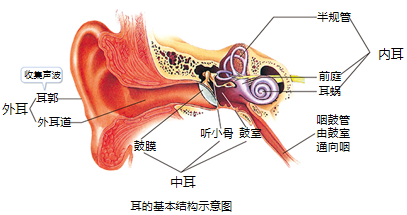
（1）耳的结构：
分为!!!!（包括!!!!）、!!!!（包括!!!!）、!!!!（包括半规管，前庭和!!!!）；
（2）视觉形成的过程
外界声波 →!!!!→!!!!（产生!!!!）→!!!!→!!!!（!!!!）→!!!!（传导冲动）→ 大脑皮层的听觉中枢（!!!! ）
答案：1. 外耳，耳廓和外耳道，中耳，鼓膜、听小骨和鼓室，内耳，耳蜗；2. 外耳道，鼓膜，振动，听小骨，耳蜗，听觉感受器，听觉神经，形成听觉。

## 四十一、关节的结构

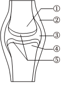

1. 关节由关节面、②
   !!!!、③!!!!组成，其中关节面由相邻的 ①!!!!、④!!!!组成。关节的结构使关节连接牢固，运动起来又非常灵活。
   （1）牢固：  
   （2）灵活：关节面的!!!! 可减少摩擦、缓冲震动；关节腔内具有关节囊内壁分泌的!!!!，可以润滑关节 2. 脱臼现象：!!!!从!!!!中滑脱出来的现象。
   答案：1. 关节囊，关节腔，关节头，关节窝，关节囊的包裹以及关节囊内外的韧带，关节软骨，滑液；2. 关节头，关节窝。

## 四十二、屈肘和伸肘运动

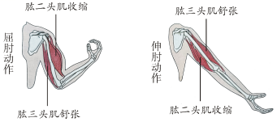

屈!!!!肘：肱二头肌!!
!!，肱三头肌!!!!
伸!!!!肘：肱二头肌!!!!，肱三头肌!!!!
自然下垂：肱二头肌、肱三头肌均!!!!
提重物时：肱二头肌、肱三头肌均!!!!
答案：收缩，舒张，舒张，收缩，舒张，收缩。

## 四十三、内分泌系统

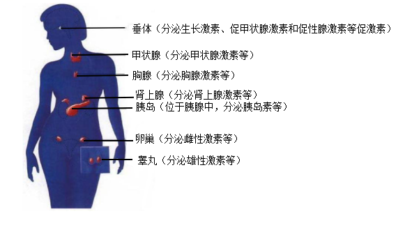

激素名称 产生部位
激素功能 分泌异常
生长激素 垂体 促进生长 1. 幼年分泌不足：!!!!； 2. 幼年分泌过多：!!!!； 3. 成年分泌过多：!!!!。
甲状腺激素 甲状腺 促进代谢；促进生长发育，提高神经系统的兴奋性。 1. 幼年分泌不足：!!!!； 2. 分泌过多：!!!!； 3. 缺碘：!!!!。
胰岛素 胰岛 调节糖类在体内的吸收、利用和转化 1. 胰岛素分泌不足：!!!!； 2. 胰岛素分泌过多：!!!!。
答案：侏儒症、巨人症、肢端肥大症、呆小症、甲亢、地方性甲状腺肿、糖尿病、低血糖。

## 四十四、人体免疫的三道防线

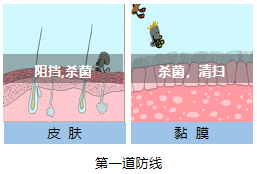
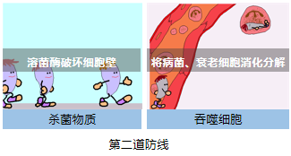

1. !!!!和!!!!是保卫人体的第一道防线。
2. 体液中的!!!!和!!!!是人体的第二道防线。
3. 第一、二道防线是人生来就有的，对各种病原体都有预防作用，叫!!!!，又称先天性免疫。
   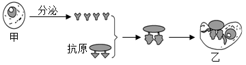
   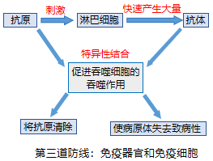
4. 第三道防线由!!!!和!!!!组成。
5. 第三道防线：出生以后才产生，只针对某一特定的病原体或异物起作用，叫做 ，又称后天性免疫。
6. !!!!：病原体侵入人体后，刺激!!!!，淋巴细胞就会产生一种抵抗该病原体的特殊蛋白质。
7. !!!!：引起人体产生抗体的物质，抗原包括：病原体、异物、器官等。
8. 抗体与抗原的结合可以促进!!!!的吞噬作用，将抗原清除；或使病原体失去致病性。
   答案：1. 皮肤，黏膜；2. 杀菌物质，吞噬细胞；3. 免疫器官，免疫细胞；4. 非特异性免疫；5. 特异性免疫；6. 抗体，淋巴细胞；7. 抗原；8. 吞噬细胞

## 四十五、人类的生殖系统

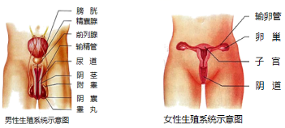1. 男性：最主要的生殖
器官是!!!!，能产生!!!!并分泌!!!!。 2. 女性：最主要的生殖器官是!!!!，能产生!!!!并分泌!!!!。
答案：1. 睾丸，精子，雄性激素；2. 卵巢，卵细胞，雌性激素

## 四十六、人的生殖过程

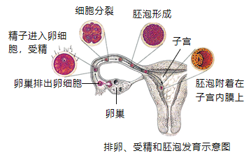1. 形成受精卵，分裂
成胚泡的场所是!!!!。 2. 怀孕指胚泡附着在!!!!上。 3. 胚胎发育的场所是!!!!。 4. 胚胎发育过程：!!!!→ 胚泡 →!!!!→ 胎儿 → 新生儿 。 5. 胚胎发育后期：通过!!!!和!!!!从母体获得营养物质。 6. 分娩：成熟的!!!!和!!!!从母体的阴道产出（38 周，266 天）。
答案：1. 输卵管；2. 子宫内膜；3. 子宫；4. 受精卵，胚胎；5. 胎盘，脐带；6. 胎儿，胎盘

## 四十七、家蚕的生殖和发育

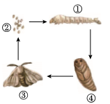

1. 生殖方式：

2. 发育方式：
3. 发育过程：
4. 家蚕在幼虫期间要经过四次蜕皮，家蚕吐丝是在!!!!，延长!!!!可以提高家蚕的吐丝量。
5. 举例：家蚕、蜜蜂、蚊（孑孓）、蝇等
   答案：1. 卵生，有性生殖，体内受精；2. 完全变态发育；3. 受精卵 → 幼虫 → 蛹 → 成虫；4. 幼虫期，幼虫期。

## 四十八、蝗虫的生殖和发育

1. 生殖方式：!!!!

2. 发育方式：
3. 发育过程：!!!!
4. 在蝗灾中，对农作物危害最大的是!!!!（运动能力强，食量大），消灭蝗虫最佳的时期是!!!!（运动能力弱）
5. 举例：蟋蟀、蝼蛄、蟑螂等
   答案：1. 卵生，有性生殖，体内受精；2. 不完全变态发育；3. 受精卵 → 幼虫 → 成虫；4. 成虫期，幼虫期。

## 四十九、两栖类的生殖和发育

1. 生殖

过程：!!!!（雄蛙鸣叫）→!!!!（雌蛙排卵、雄蛙排精）→!!!!
特点：!!!! 2. 发育
过程：  
特点：!!!! 3. 两栖动物在 的特点，限制了两栖动物的分布范围，这是其种类较少的主要原因。
答案：1. 求偶，抱对，体外受精，卵生，有性生殖，体外受精；2. 受精卵 → 蝌蚪 → 幼蛙 → 成蛙，变态发育；3. 生殖和发育过程中离不开水。

## 五十、鸟卵的结构

1. 鸟类的生殖与发
育
过程：!!!!（所有鸟类都具有!!!! 这三个行为）
特点：  
2. 鸟卵的结构
②!!!!：起保护作用，有小孔透气
⑥!!!!：内外卵壳膜在为胚胎发育提供!!!!
⑧!!!!：保护作用
⑦!!!!：为胚胎发育!!!!  
③!!!!：起固定卵黄、减震的作用
④!!!!：保护作用
⑤!!!!：卵细胞的主要营养部分，为胚胎发育!!!!
①!!!!：含有!!!!。未受精的卵，胚盘!!!!，已受精的卵，胚盘色!!!!，胚盘在受精后可发育成!!!!，继而发育成!!!!。
答案：1. 筑巢、求偶、交配、产卵、孵卵、育雏，求偶、交配、产卵，雌雄异体、体内受精、卵生；2. 卵壳，气室，氧气，卵壳膜，卵白，提供营养物质和水分，系带，卵黄膜，卵黄，提供营养物质，胚盘，细胞核，色浅而小，浓而略大，胚胎，雏鸟。

## 五十一、染色体与 DNA 的关系示意图

1. 基因是染色体上具有!!!!的 DNA 片段。
2. DNA：是主要的!!!!，呈双螺旋结构。
3. 染色体：!!!!内能被碱性染料染成深色的物质，染色体是遗传物质的载体。
4. 在体细胞中，染色体!!!!存在，基因也!!!!存在，位于!!!!的染色体上。
5. 人体细胞中有!!!!对染色体，就有!!!!个 DNA 分子，有数万对基因。
   答案：1. 遗传效应；2. 遗传物质；3. 细胞核；4. 成对，成对，成对；5. 23，46。

## 五十二、生殖过程中染色体的变化

1. 在形成精子或卵细胞的细胞分裂过程中，染色体都要减少!!!!，而不是任意的一半，是每对染色体中各有!!!!进入精子或卵细胞。
   答案：1. 一半，一条。

## 五十三、孟德尔的豌豆杂交实验遗传图解

1. 遗传学之父是!!!!。
2. 相对性状有!!!!和!!!!两种。
3. 控制相对性状的基因有!!!!和!!!!两种。
4. 显性基因的基因组成：!!!!和!!!!，隐性基因的基因组成：!!!!。（用字母 A 和 a 表示）
   答案：1. 孟德尔；2. 显性性状，隐性性状；3. 显性基因，隐性基因；4. AA 和 Aa，aa 。

## 五十四、性别决定过程图解

1. 男性体细胞染色体可表示为：!!!!。 女性体细胞染色体可表示为：!!!!。
2. 男性精子中的染色体组成是!!!!或者是!!!!。
3. 女性卵细胞中的染色体组成是!!!!，所以男性有!!!!精子，女性只有!!!!卵细胞。
4. 生男生女的机会!!!!（1:1）。
   答案：1. 22 对+XY、22 对+XX；2. 22 条＋ X、22 条＋ Y；3. 22 条＋ X、两种、一种；4. 均等。

## 五十五、米勒实验以及化学起源说

1. 生命起源的学说：!!!!
2. 原始大气的成分：水蒸气、氢气、氨气、甲烷、二氧化碳、硫化氢等，但原始大气中没有!!!!
3. 米勒模拟原始地球条件的实验
   （1）过程：盛有气体的装置： ；盛有沸水的装置：!!!! ；火花放电：!!!! ；泠凝器：!!!! 。
   （2）结果：产生原先不存在的多种氨基酸等有机小分子
   （3）结论：!!!!（即只验证了生命起源的第一步）
4. 原始生命起源于!!!!
5. 生命起源过程中最重要的一步：!!!!，即从蛋白质、核酸等有机大分子形成原始生命的过程
6. 发生在原始大气中的过程：!!!!
7. 发生在原始海洋中的过程：  
   答案：1. 化学演化学说；2. 氧气；3. 模拟原始大气成分，提供水蒸气和高温，模拟闪电、提供能量，模拟降雨；4. 原始海洋；5. 第三步；6. 第一步；7. 第二、三步。

## 五十六、动植物进化的大致过程

1. 生物进化的主要证据之一-!!
   !! 2. 化石分布规律：!!!!的生物化石总是出现在越古老的地层里；!!!!的生物化石则出现在越新近形成的地层里。 3. 植物进化历程 4. 动物进化历程
   原始单细胞生物 → 无脊椎动物（腔肠动物 → 扁形动物 → 线形动物 → 环节动物 → 软体动物 → 节肢动物）→ 脊椎动物（古代鱼 → 古代两栖动物 → 古代爬行动物 → 古代鸟和哺乳动物） 5. 生物进化的总趋势
   由!!!!、!!!!（地位）、!!!!（细胞结构）、!!!!（生活环境）  
   答案：1. 化石；2. 越简单、越低等，越复杂、越高等；5. 单细胞到多细胞 ，由低等到高等，由简单到复杂，由水生到陆生。
