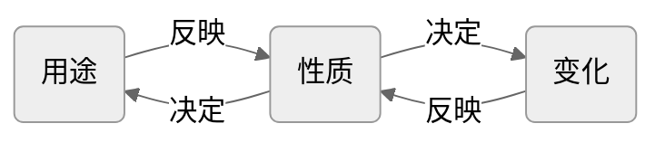

# 物理 vs 化学 ⭐⭐⭐

## 物理变化和化学变化 ⭐⭐⭐

:::: card-grid
::: card title="物理变化" icon="hugeicons:physics"

`定义`：没有生成新物质的变化

`特征`: ==无新物质生成==

`举例`：蜡烛的熔化、酒精的挥发、铁水铸成锅

`微观实质`：分子本身没有发生变化

:::

::: card title="化学变化" icon="hugeicons:chemistry-01"

`定义`：生成新物质的变化（又叫==化学反应==）

`特征`: ==生成新物质==

`举例`：蜡烛的燃烧、铁生锈、食物变质

`微观实质`：分子破裂成原子，再重组为新分子。

:::
::::

`本质区别`：==变化时是否有新物质产生==。

`相互联系`：==在发生化学变化的过程中一定伴随着物理变化==，而发生物理变化时不一定同时发生化学变化。

::: warning 爆炸可能是物理变化，也可能是化学变化。

如轮胎“爆胎”、蒸汽锅炉因压力过大而发生的爆炸，这些过程中无新物质生成，发生的是物理变化；而火药爆炸、瓦斯爆炸，这些变化过程中生成了新物质，发生的是化学变化。

:::

## 物理性质和化学性质 ⭐⭐⭐

:::: card-grid
::: card title="物理性质" icon="hugeicons:physics"

`概念`：==物质不需要发生化学变化就表现出来的性质==

`特点`: 构成物质的基本粒子（如分子）集体才能表现出来。

`举例`：颜色、状态、气味、熔点、沸点、硬度、密度、挥发性、溶解性、吸附性、导电性、导热性、延展性等

:::

::: card title="化学变化" icon="hugeicons:chemistry-01"

`概念`：==物质在化学变化中表现出来的性质==

`特点`: 构成物质的单个粒子（如分子、原子、离子）就能表现出来。

`举例`：可燃性、助燃性、稳定性、还原性、氧化性、腐蚀性、酸碱性、毒性等。

:::
::::

`根本区别`：==是否需要通过化学变化表现出来==。

## 物质的性质和用途的关系

