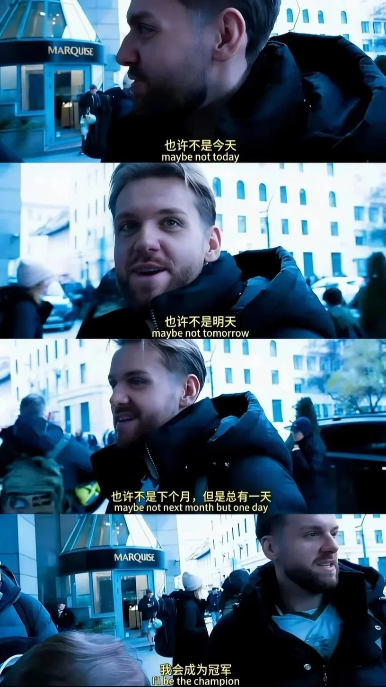

## 第一步：诊断（15 分钟）

> 在草稿纸上写 1-15 的答案。做完对答案，圈出错题号。

1. The medicine ==\_== by millions of people all over the world every year.

- A. uses  B. is used  C. was used

2. The children felt ==\_== after watching the ==\_== magic show.

- A. exciting; excited  B. excited; exciting  C. excited; excited

3. Last month, my uncle ==\_== back from Canada and ==\_== us many gifts.

- A. comes; brings  B. came; brought  C. has come; has brought

4. Since 2020, the small village ==\_== into a modern town.

- A. turns  B. turned  C. has turned

5. ==\_== important advice Mr. Wang gave us before the exam!

- A. What  B. What an  C. How

6. The young man saved every penny ==\_== a gift for his mother on her birthday.

- A. buy  B. buying  C. to buy

7. The police ==\_== already ==\_== the thief who stole the old lady's bag.

- A. has; caught  B. have; caught  C. was; catching

8. ==\_== Browns often play ==\_== chess together after ==\_== supper.

- A. The; /; /  B. /; the; the  C. The; the; /

9. — Which of the two skirts do you like?
— ==\_== . They are both too expensive for me.

- A. None  B. Neither  C. Either

10. This math problem is not as ==\_== as the one we did yesterday.

- A. difficult  B. more difficult  C. most difficult

11. My brother usually ==\_== up at six o'clock every morning.

- A. get  B. gets  C. got

12. This is not ==\_== book. ==\_== is on the desk over there.

- A. my; My  B. my; Mine  C. mine; My

13. We usually have the first class ==\_== 8:00 ==\_== the morning.

- A. at; in  B. in; at  C. on; in

14. My mother enjoys ==\_== in the park after dinner every day.

- A. walk  B. walking  C. to walk

15. He studied very hard, ==\_== he didn't pass the exam.

- A. so  B. because  C. but

---

## 答案（对答案用）

|  1  |  2  |  3  |  4  |  5  |  6  |  7  |  8  |  9  | 10  | 11  | 12  | 13  | 14  | 15  |
| :-: | :-: | :-: | :-: | :-: | :-: | :-: | :-: | :-: | :-: | :-: | :-: | :-: | :-: | :-: |
|  B  |  B  |  B  |  C  |  A  |  C  |  B  |  A  |  B  |  A  |  B  |  B  |  A  |  B  |  C  |

> 错题号就是你的编号。比如错了第 1 题，你写 1

---

## 第二步：自助卡片（5 分钟浏览）

> 往下翻，看到你需要的就记下编号。每张卡片都会打印给你。

---

### A1 · 拼写陷阱词 25 个

| 中文       | 英文            | 中文       | 英文              |
| ---------- | --------------- | ---------- | ----------------- |
| 收到       | ==receive==     | 成功的     | ==successful==    |
| 相信       | ==believe==     | 立刻       | ==immediately==   |
| 必要的     | ==necessary==   | 餐馆       | ==restaurant==    |
| 环境       | ==environment== | 星期三     | ==Wednesday==     |
| 不同的     | ==different==   | 外国的     | ==foreign==       |
| 美丽的     | ==beautiful==   | 知识       | ==knowledge==     |
| 舒服的     | ==comfortable== | 诚实地     | ==honestly==      |
| 建议（名） | ==suggestion==  | 发音（名） | ==pronunciation== |
| 经验；经历 | ==experience==  | 解释（名） | ==explanation==   |
| 方便的     | ==convenient==  | 竞赛       | ==competition==   |
| 政府       | ==government==  | 决定（名） | ==decision==      |
| 温度       | ==temperature== | 采访；面试 | ==interview==     |
| 惊讶的     | ==surprised==   |            |                   |

---

### A2 · 形近易混词

| 英文        | 中文       | 英文         | 中文         |
| ----------- | ---------- | ------------ | ------------ |
| ==quite==   | 相当，十分 | ==quiet==    | 安静的       |
| ==expect==  | 期待       | ==except==   | 除……之外     |
| ==abroad==  | 在国外     | ==aboard==   | 上船/车/飞机 |
| ==desert==  | 沙漠；抛弃 | ==dessert==  | 甜点         |
| ==hard==    | 努力；困难 | ==hardly==   | 几乎不       |
| ==beside==  | 在……旁边   | ==besides==  | 此外         |
| ==whether== | 是否       | ==weather==  | 天气         |
| ==price==   | 价格       | ==prize==    | 奖品         |
| ==alone==   | 独自       | ==lonely==   | 孤独         |
| ==lay==     | 下蛋；放置 | ==lie==      | 躺；说谎     |
| ==sweet==   | 甜的       | ==sweat==    | 汗水         |
| ==plant==   | 植物       | ==plane==    | 飞机         |
| ==promise== | 承诺       | ==progress== | 进步         |
| ==aloud==   | 出声地     | ==loud==     | 大声的       |
| ==chance==  | 机会       | ==change==   | 改变         |

---

### A3a · 不规则动词 ① 最高频（1-10）

| 中文 | 原形 | 过去式   | 过去分词   |
| ---- | ---- | -------- | ---------- |
| 做   | do   | did      | done       |
| 是   | be   | was/were | been       |
| 得到 | get  | got      | got/gotten |
| 来   | come | came     | come       |
| 去   | go   | went     | gone       |
| 说   | say  | said     | said       |
| 给   | give | gave     | given      |
| 看见 | see  | saw      | seen       |
| 有   | have | had      | had        |
| 感觉 | feel | felt     | felt       |

---

### A3b · 不规则动词 ② 次高频（11-20）

| 中文 | 原形   | 过去式  | 过去分词 |
| ---- | ------ | ------- | -------- |
| 做   | make   | made    | made     |
| 知道 | know   | knew    | known    |
| 发现 | find   | found   | found    |
| 成为 | become | became  | become   |
| 离开 | leave  | left    | left     |
| 带来 | bring  | brought | brought  |
| 买   | buy    | bought  | bought   |
| 写   | write  | wrote   | written  |
| 吃   | eat    | ate     | eaten    |
| 遇见 | meet   | met     | met      |

---

### A3c · 不规则动词 ③ 易错（21-30）

| 中文     | 原形   | 过去式 | 过去分词  |
| -------- | ------ | ------ | --------- |
| 建造     | build  | built  | built     |
| 开始     | begin  | began  | begun     |
| 开车     | drive  | drove  | driven    |
| 抓；赶上 | catch  | caught | caught    |
| 打破     | break  | broke  | broken    |
| 选择     | choose | chose  | chosen    |
| 喝       | drink  | drank  | drunk     |
| 飞       | fly    | flew   | flown     |
| 忘记     | forget | forgot | forgotten |
| 画       | draw   | drew   | drawn     |

---

### A4 · 文章来源 / 出处词

> 阅读 A 篇最后一题："这篇文章最可能来自哪里？"

| 英文      | 中文   | 英文          | 中文     |
| --------- | ------ | ------------- | -------- |
| Newspaper | 报纸   | Website       | 网站     |
| Magazine  | 杂志   | Advertisement | 广告     |
| Storybook | 故事书 | Guidebook     | 旅游指南 |
| Notice    | 通知   | Report        | 报告     |
| Culture   | 文化   | Science       | 科学     |
| Nature    | 自然   | Technology    | 科技     |
| Health    | 健康   | Sports        | 体育     |
| Travel    | 旅游   | History       | 历史     |
| Education | 教育   | Environment   | 环境     |

---

### A5 · AI 话题词汇

| 英文       | 中文       | 英文          | 中文       |
| ---------- | ---------- | ------------- | ---------- |
| AI         | 人工智能   | tool          | 工具       |
| technology | 技术       | robot         | 机器人     |
| smart      | 智能的     | chatbot       | 聊天机器人 |
| convenient | 便捷的     | efficient     | 高效的     |
| creative   | 有创造力的 | skill         | 技能       |
| advantage  | 优点       | disadvantage  | 缺点       |
| improve    | 提升       | save time     | 节省时间   |
| depend on  | 依赖       | make mistakes | 犯错       |

---

### B1 · 短语① 基础搭配（1-10）

|  #  | 短语                | 中文       |
| :-: | ------------------- | ---------- |
|  1  | after all           | 毕竟；终究 |
|  2  | look after          | 照顾；照看 |
|  3  | laugh at            | 嘲笑       |
|  4  | be good at          | 擅长       |
|  5  | at last             | 最后；终于 |
|  6  | try one's best      | 尽力       |
|  7  | not only...but also | 不仅……而且 |
|  8  | by mistake          | 错误地     |
|  9  | by oneself          | 独自；单独 |
| 10  | be used to doing    | 习惯于做   |

---

### B2 · 短语② doing / for / from（11-20）

|  #  | 短语              | 中文       |
| :-: | ----------------- | ---------- |
| 11  | can't help doing  | 忍不住做   |
| 12  | keep doing        | 不停地做   |
| 13  | spend...doing     | 花费……做   |
| 14  | turn down         | 拒绝；关小 |
| 15  | hear from         | 收到……来信 |
| 16  | be good for       | 对……有好处 |
| 17  | be used for       | 被用来做   |
| 18  | protect...from    | 保护……免遭 |
| 19  | be different from | 与……不同   |
| 20  | be interested in  | 对……感兴趣 |

---

### B3 · 短语③ of / in / on（21-30）

|  #  | 短语          | 中文               |
| :-: | ------------- | ------------------ |
| 21  | in the end    | 最后               |
| 22  | in time       | 及时               |
| 23  | neither...nor | 既不……也不         |
| 24  | run out of    | 用完；耗尽         |
| 25  | instead of    | 代替；而不是       |
| 26  | remind sb of  | 使某人想起         |
| 27  | be made of    | 由……制成（看得出） |
| 28  | put off       | 推迟；拖延         |
| 29  | put on        | 穿上；上演         |
| 30  | depend on     | 取决于；依靠       |

---

### B4 · 短语④ to / 句型（31-40）

|  #  | 短语                  | 中文             |
| :-: | --------------------- | ---------------- |
| 31  | find out              | 查明；发现       |
| 32  | give out              | 分发；用完       |
| 33  | look forward to doing | 期盼             |
| 34  | too...to              | 太……而不能       |
| 35  | pay attention to      | 注意             |
| 36  | used to do            | 过去常常做       |
| 37  | not...until           | 直到……才         |
| 38  | pick up               | 捡起；接人；学会 |
| 39  | come up with          | 想出（主意等）   |
| 40  | deal with             | 处理；应付       |

---

### B5 · 短语⑤ with / 易混（41-50）

|  #  | 短语           | 中文         |
| :-: | -------------- | ------------ |
| 41  | catch up with  | 赶上；追上   |
| 42  | get along with | 与……相处     |
| 43  | compare...with | 把……与……比较 |
| 44  | be proud of    | 为……而骄傲   |
| 45  | hundreds of    | 成百上千的   |
| 46  | be tired of    | 对……厌倦     |
| 47  | die of         | 死于（内因） |
| 48  | agree with     | 赞同某人     |
| 49  | provide...with | 提供；供给   |
| 50  | be filled with | 充满         |

---

### C1 · 宾语从句引导词

| 引导词     | 含义      | 情景/例句                                              |
| ---------- | --------- | ------------------------------------------------------ |
| that       | 无        | 陈述，不缺信息，常省略 that<br>I think (that) he is OK. |
| if/whether | 是否      | 缺少或需要回答"是否"<br>I wonder if he is OK.           |
| what       | 东西      | I wonder what you have.                                |
| who        | 人        | I wonder who you are.                                  |
| where      | 地方      | I wonder where you are.                                |
| when       | 时候      | I wonder when you'll come.                             |
| how        | 方式/感受 | I wonder how you came.                                 |
| why        | 原因      | I wonder why you came.                                 |

---

### C1b · 常接宾语从句的动词

| 类别      | 动词       | 中文       |
| --------- | ---------- | ---------- |
| 说        | say        | 说         |
|           | tell       | 告诉       |
|           | report     | 报告       |
|           | explain    | 解释       |
|           | suggest    | 建议       |
|           | advise     | 劝告       |
| 想/认为   | think      | 想；认为   |
|           | believe    | 相信       |
|           | suppose    | 假设；认为 |
|           | guess      | 猜         |
|           | feel       | 感觉       |
| 知道/发现 | know       | 知道       |
|           | understand | 理解       |
|           | see        | 看到；明白 |
|           | find       | 发现       |
|           | realize    | 意识到     |
|           | notice     | 注意到     |
| 希望/决定 | wish       | 希望       |
|           | hope       | 希望       |
|           | decide     | 决定       |
|           | agree      | 同意       |

---

### C1c · 并列连词 and / or / but

1. ==and== 前后语法并列（名词/动词短语/介词短语等）
2. ==and== 表顺承，==but== 表转折，==or== 表选择
3. ==and== 前后并列，==but== 前后相反
4. 阅读时 ==but== 后面往往是重点
5. ==or== 在回答问题可能构成选择疑问句，答案二选一
6. 否定句用 ==or== 不用 and：`I have no brothers or sisters.`

---

### C1d · 连词搭配

| 连词搭配              | 释义           |
| --------------------- | -------------- |
| both ... and          | ……和……都       |
| not only ... but also | 不仅……而且……   |
| neither ... nor       | 既不……也不……   |
| either ... or         | 要么……要么……   |
| so ... that           | 如此……以至于…… |
| such ... that         | 如此……以至于…… |

---

### C2 · 阅读理解 7 题型攻略

| 题型      | 怎么做                      |
| --------- | --------------------------- |
| 细节理解  | 定位原文→找原词或同义替换   |
| 推理判断  | 原文 + 一步推理，别推太远   |
| 词义猜测  | 看 X 前后句，不看选项       |
| 主旨大意  | 读首段+末段+每段首句        |
| 标题归纳  | 同主旨，但要凝练成 3-5 词   |
| 代词指代  | 往==前一句==找最近的名词    |
| 排序/还原 | 看时间词<br>看空格前后逻辑词 |

---

### C3 · 短文填空三步法

```
① 看方框标词性 → n./v./adj./adv./prep./conj.
② 逐空判断 → 先定词性，再定词形（要不要变形？）
③ 代入通读 → 检查是否通顺，划掉已用的词
```

常见变形：名词→复数 / 动词→三单/过去式/过去分词 / 形容词→副词 +ly / 形容词→比较级

---

### C4 · 回答问题定位法

```
① 圈关键词 → 人名/地名/数字/时间
② 回原文扫读 → 找到关键词所在的那 1-2 句
③ 抄写 → 原文 I 改 he/she，my 改 his/her，不要整句照抄
```

---

### C5 · 限定词

> 限定词放在名词前，限定数量/归属/泛指/特指，与名词构成名词短语。

| 类别       | 例词                                                                  |
| ---------- | --------------------------------------------------------------------- |
| 冠词       | a, an, the                                                            |
| 指示限定词 | this, that, these, those                                              |
| 形物代     | my, your, his, her, its, our, their                                   |
| 名词所有格 | Mike's, three hours'                                                  |
| 不定限定词 | some, any, other, another, few, little, many, much, a lot of, lots of |
| 量词短语   | a set of, 3 pairs of                                                  |
| 基数词     | one, two, one hundred                                                 |
| 序数词     | the first, the fifth                                                  |
| 疑问限定词 | what, whose, which                                                    |

---

### C6 · of 的用法

| 用法             | 结构                         | 例句                                   |
| ---------------- | ---------------------------- | -------------------------------------- |
| ……的             | 名词短语 + of + 名词短语     | a friend of mine, a photo of my family |
| 某人做某事是……的 | It's + adj. + of sb. + to do | It's kind of you to help others.       |
| 含 of 的短语     | because of                   | 由于；因为                             |

---

### C7 · for 的用法

| 用法                               | 例句/短语                          |
| ---------------------------------- | ---------------------------------- |
| 为；给（目的）                     | study for a test, wait for         |
| 因为；由于（原因）                 | be famous for, thanks for          |
| 对……来说                           | for me                             |
| 做某事对某人来说是……的             | It's + adj. + for sb. + to do      |
| 对……有好处                         | be good for                        |
| 持续……（for + 时间段，完成时标志） | for a long time, study for 2 hours |

---

### C8 · with 的用法

| 用法                   | 例句                                                              |
| ---------------------- | ----------------------------------------------------------------- |
| 有；具有；带有（伴随） | a man with glasses<br>a kid with a big smile<br>a house with a garden |
| 和……一起（伴随）       | play with me, travel with my friends                              |
| 用……；凭借……（方式）   | with your help                                                    |

---

### D1 · 通用模板

```
主题 plays an important role in our life. Let me tell you.

First of all, ...
What's more, ...
In the end, ...
All in all, for me, I will pay more attention to 主题. Let's take action!
```

---

### D2 · 记叙文

```
Life is full of challenges and difficulties. I'll never forget the day when I fail the exam.

At first, I felt so nervous that I was about to give up. Then, it was my friend who encouraged me to keep trying. Gradually, my grades got better and better, and I became more confident.

This experience taught me a valuable lesson: never give up.
```

---

### D3 · 建议信

```
you should do sth.
it's important to do sth.
it might be a good idea to do sth.
you are supposed to do sth.

we shouldn't do sth.
don't do sth.
```

---

### D4 · 最低成本草稿① 投票邀请

> 2025 广东中考 · 电子邮件 · 李明→交换生 Peter

学校与博物馆合作办民俗体验活动，请同学投票选最想体验的项目。目前舞狮和剪纸票数最高。你选了舞狮。邀请 Peter 参与投票。

==最低成本草稿：==
People like lion dance and paper cutting best.
My favorite is lion dance.
I hope you can come and vote.

---

### D5 · 最低成本草稿② 导游自荐

> 2026 兴宁宋声一模 · 自荐信 · 李华→博物馆馆长

市博物馆招募英语导游。你英文好、沟通强、喜欢历史。写自荐信表达意愿。

==最低成本草稿：==
I want to be the English guide.
I am good at speaking English.
I like history very much.

---

### D6 · 记叙文话题改装

> 背熟 D2 记叙文，换 3 处就能套任何经历类题目。

==1. 分享梦==
Life is full of challenges and difficulties. I'll never forget the day when I fail the exam ==in my dream==.
（正文不变）
This ==dream== taught me a valuable lesson: never give up.

==2. AI==
==AI plays an important role in our life.== I'll never forget the day when I fail the exam.
... It was ==AI== who encouraged ...
This experience taught me a valuable lesson: ==we should use AI to study.==

==3. 志愿经历==
Life is full of challenges and difficulties. I'll never forget the day when I ==volunteer in the ...==.
... Gradually/Finally, ==...==, and I became more confident.
This ==volunteer== experience taught me a valuable lesson: never give up.
