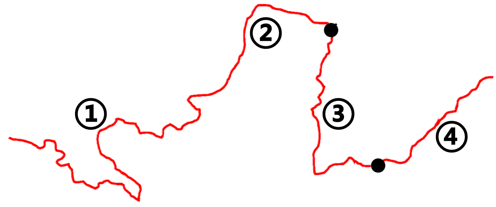

## 一、疆域

1. 中国的地理位置：
   - 半球位置：中国位于!!东半球!!、 !!北半球!! 。
   - 纬度位置：处于!!中!!纬度地区；大部分在!!北温!!带，南部部分地区位于!!热!!带，没有!!寒!!带。
   - 海陆位置：中国位于世界最大大陆—!!亚欧大陆!!的东部，世界最大大洋—!!太平洋!!的西岸，是一个!!海陆兼备!!的国家。
2. 中国领土四至点
   - 最北端： !!黑龙江!!省!!漠河!!市北端黑龙江主航道中心线（53°N）
   - 最南端： !!海南!!省!!曾母暗沙!! （4°N）
   - 最东端： !!黑龙江!!省黑龙江与乌苏里江主航道中心线的汇合处（135°E）
   - 最西端： !!新疆维吾尔自治区!!的!!帕米尔高原!!上（73°E）
3. 临海从北向南依次是：!!渤海!! 、 !!黄海!!、 !!东海!! 、!!南海!!
4. 中国内海： !!渤海!!、 !!琼州海峡!!
5. 既陆上相邻，又隔海相望的国家：!!越南、朝鲜!!
6. 我国三级行政区划是：!!省!!、!!县!!、!!乡!!

### 34 个省级行政区域的名称、简称和行政中心

| 序号 | 名称               | 简称        | 行政中心   | 序号 | 名称                 | 简称        | 行政中心     |
| ---- | ------------------ | ----------- | ---------- | ---- | -------------------- | ----------- | ------------ |
| 1    | !!天津市!!         | !!津!!      | !!天津!!   | 18   | !!河南省!!           | !!豫!!      | !!郑州!!     |
| 2    | !!北京市!!         | !!京!!      | !!北京!!   | 19   | !!上海市!!           | !!沪!!      | !!上海!!     |
| 3    | !!河北省!!         | !!冀!!      | !!石家庄!! | 20   | !!黑龙江省!!         | !!黑!!      | !!哈尔滨!!   |
| 4    | !!甘肃省!!         | !!甘 / 陇!! | !!兰州!!   | 21   | !!吉林省!!           | !!吉!!      | !!长春!!     |
| 5    | !!宁夏回族自治区!! | !!宁!!      | !!银川!!   | 22   | !!辽宁省!!           | !!辽!!      | !!沈阳!!     |
| 6    | !!四川省!!         | !!川 / 蜀!! | !!成都!!   | 23   | !!山西省!!           | !!晋!!      | !!太原!!     |
| 7    | !!重庆市!!         | !!渝!!      | !!重庆!!   | 24   | !!山东省!!           | !!鲁!!      | !!济南!!     |
| 8    | !!贵州省!!         | !!贵 / 黔!! | !!贵阳!!   | 25   | !!内蒙古自治区!!     | !!内蒙古!!  | !!呼和浩特!! |
| 9    | !!云南省!!         | !!云 / 滇!! | !!昆明!!   | 26   | !!陕西省!!           | !!陕 / 秦!! | !!西安!!     |
| 10   | !!广西壮族自治区!! | !!桂!!      | !!南宁!!   | 27   | !!新疆维吾尔自治区!! | !!新!!      | !!乌鲁木齐!! |
| 11   | !!海南省!!         | !!琼!!      | !!海口!!   | 28   | !!西藏自治区!!       | !!藏!!      | !!拉萨!!     |
| 12   | !!广东省!!         | !!粤!!      | !!广州!!   | 29   | !!青海省!!           | !!青!!      | !!西宁!!     |
| 13   | !!福建省!!         | !!闽!!      | !!福州!!   | 30   | !!江苏省!!           | !!苏!!      | !!南京!!     |
| 14   | !!江西省!!         | !!赣!!      | !!南昌!!   | 31   | !!浙江省!!           | !!浙!!      | !!杭州!!     |
| 15   | !!湖南省!!         | !!湘!!      | !!长沙!!   | 32   | !!台湾省!!           | !!台!!      | !!台北!!     |
| 16   | !!湖北省!!         | !!鄂!!      | !!武汉!!   | 33   | !!澳门特别行政区!!   | !!澳!!      | !!澳门!!     |
| 17   | !!安徽省!!         | !!皖!!      | !!合肥!!   | 34   | !!香港特别行政区!!   | !!港!!      | !!香港!!     |

## 二、人口和民族

1. 人口众多的有利影响：!!劳动力资源丰富，消费市场广阔!!；不利影响：!!居住条件差、就业困难、交通拥堵、饥饿贫困!!
2. 我国人口基本国策：!!计划生育!!。
3. 我国人口分布特点：!!东南稠密，西北稀疏!!，人口地理分界线是!!黑河—腾冲一线!!
4. 我国共个!!56!!民族，人口最多的民族是!!汉族!!。
5. !!55!!个少数民族。人口最多的少数民族，人口超 1600 万的是：!!壮族!!
6. 民族活动
   | 民族 | 活动 | 民族 | 活动 |
   |-----|-------------|------|----------|
   | 傣族 | !!泼水节、孔雀舞、竹林!! | 高山族 | !!丰收节、台湾省!! |
   | 苗族 | !!苗年、跳芦笙!! | 蒙古族 | !!那达慕节、摔跤!! |
   | 藏族 | !!雪顿节、展佛、平顶碉房!! | 汉族 | !!元宵节!! |
   | 朝鲜族 | !!长鼓舞、荡秋千!! | 维吾尔族 | !!古尔邦节、手鼓舞!! |
   | 壮族 | !!三月三歌节!! | | |
7. 民族分布特点：!!大杂居、小聚居、交错居住!!
8. !!汉族!!人口遍布全国，少数民族主要分布在!!西南 西北 东北!!

## 三、中国自然环境

1. 地形特征： !!地形类型多样，山区面积广大!!
2. 通常把山地、丘陵，连同比较崎岖的高原统称为!!山区!!。
3. 我国山区面积广大，对经济的发展的有利条件和不利条件
   - 不利条件： !!山区地面崎岖，交通不便；耕地少，不利于发展种植业；易发生滑坡、泥石流等地质灾害。!!
   - 有利条件： !!山区有利于发展林业、牧业、旅游业、采矿业等。!!
4. 地势特征：!!西高东低!!，!!呈阶梯状分布!!。
5. 我国地势分三级阶梯，阶梯分界线：
   - 第一、二级阶梯分界线： !!昆仑山——祁连山——横断山脉!!
   - 第二、三级阶梯分界线：!!大兴安岭——太行山——巫山——雪峰山!!
6. 山脉两侧的地形区
   | 山脉 | 西侧地形区 | 东侧地形区 |
   |------|-----------|---------------|
   | 横断山脉 | !!青藏高原!! | !!四川盆地、云贵高原!! |
   | 巫山 | !!四川盆地!! | !!长江中下游平原!! |
   | 太行山脉 | !!黄土高原!! | !!华北平原!! |
   | 大兴安岭 | !!内蒙古高原!! | !!东北平原!! |

   | 山脉     | 北侧地形区     | 南侧地形区     |
   | -------- | -------------- | -------------- |
   | 天山山脉 | !!准噶尔盆地!! | !!塔里木盆地!! |
   | 昆仑山脉 | !!塔里木盆地!! | !!青藏高原!!   |
   | 秦岭     | !!黄土高原!!   | !!四川盆地!!   |

7. 我国气温的分布特征：!!冬季南北温差大，夏季普遍高温!!
8. 1 月 0°C 等温线大致沿!!秦岭—淮河!!一线分布。
9. 我国夏季最热的地方是：!!新疆的吐鲁番!!
10. 我国冬季最冷的地方是：!!黑龙江省漠河市的北极村!!
11. 我国温度带对应生产生活
    <table>
    <thead>
        <tr>
            <th>温度带</th>
            <th>水果</th>
            <th>地形区</th>
            <th>作物熟制</th>
            <th>民居</th>
        </tr>
      </thead>
      <tbody>
        <tr>
            <th>热带</th>
            <td>椰子、香蕉</td>
            <td></td>
            <td><Plot>一年三熟</Plot></td>
            <td rowspan="2"><Plot>高大宽敞 注重通风透气 屋顶坡度较大</Plot></td>
        </tr>
        <tr>
            <th>亚热带</th>
            <td><Plot>柑橘</Plot></td>
            <td><Plot>长江中下游平原 云贵高原、四川盆地 东南丘陵</Plot></td>
            <td><Plot>一年两到三熟</Plot></td>
        </tr>
        <tr>
            <th>暖温带</th>
            <td>苹果、梨</td>
            <td><Plot>山东丘陵、辽东丘陵 黄土高原、华北平原 塔里木盆地</Plot></td>
            <td><Plot>两年三熟 （华北）</Plot></td>
            <td rowspan="4"><Plot>大多坐北朝南 密闭程度较高 墙体较厚 双层窗户 火墙 屋顶坡度较小</Plot></td>
        </tr>
        <tr>
            <th>中温带</th>
            <td></td>
            <td><Plot>东北平原 内蒙古高原 准噶尔盆地</Plot></td>
            <td rowspan="3"><Plot>一年一熟</Plot></td>
        </tr>
        <tr>
            <th>寒温带</th>
            <td></td>
            <td>大兴安岭北部</td>
        </tr>
        <tr>
            <th>青藏高原区</th>
            <td></td>
            <td>青藏高原</td>
        </tr>
      </tbody>
    </table>
12. 我国降水的空间（地区）分布规律：!!由东南沿海向西北内陆逐渐减少。!!
13. 800 毫米等降水量线大致经过!!秦岭—淮河!!一线。
14. 我国年降水量多的地方是： !!台湾的火烧寮!!
15. 我国年降水量最少的地方是：。!!吐鲁番盆地的托克逊!!
16. 我国干湿区对应生产生活
    | 干湿地区 | 降水量 （毫米） | 植被类型 | 耕地类型 | 农业类型 | 农作物 | 民居 | 四大地理区域 |
    |------|---------------|----------|--------|---------|-----------|----------|-------------|
    | 湿润区 | !!大于 800mm!! | !!森林!! | !!水田!! | !!种植业!! | !!水稻!! | !!斜顶!! | !!南方地区!! |
    | 半湿润区 | !!400—800mm!! | !!森林草原!! | !!旱地!! | !!种植业!! | !!小麦、玉米!! | !!斜顶!! | !!北方地区!! |
    | 半干旱区 | !!200—400mm!! | !!草原!! | ———— | !!畜牧业!! | ———— | !!平顶!! | !!西北地区!! !!青藏地区!! |
    | 干旱区 | !!小于 200mm!! | !!荒漠!! | ———— | !!畜牧业!! | ———— | !!平顶!! | !!西北地区!! !!青藏地区!! |
17. 我国的气候特征：!!季风气候显著，气候复杂多样!!
18. 我国气候类型分布
    - 我国东部地区是世界上典型的季风气候区，由北向南分布着!!温带季风气候、亚热带季风气候、热带季风气候!!
    - 我国西北部分布着!!温带大陆性气候!!。
    - 青藏高原地区分布着!!高原山地气候!!。
19. 我国主要气候类型特点
    - 热带季风气候：!!终年高温，降水分为旱、雨两季!!
    - 亚热带季风气候：!!冬季温和少雨，夏季高温多雨!!
    - 温带季风气候：!!冬季寒冷干燥，夏季高温多雨!!
    - 温带大陆性气候：!!冬冷夏热，气温年较差大，全年降水较少!!
    - 高原山地气候：!!高寒气候，全面低温，降水少!!
20. 影响气候的主要因素是!!纬度位置、海陆位置、地形因素!!
21. 我国以外流河为主
    - 注入太平洋的河流：!!黑龙江、黄河、淮河、长江、珠江、澜沧江!!
    - 注入印度洋的河流 ：!!怒江、雅鲁藏布江!!
    - 注入北冰洋的河流 ：!!额尔齐斯河!!
    - 我国最长内流河：!!塔里木河!!
22. 我国外流河主要分布在东南部的!!湿润和半湿润区!!，内流河主要分布在西北部的!!干旱和半干旱区!!。
23. 长江
    | 发源地 | !!青藏高原上的唐古拉山脉，发源地位于青海省!! |
    |-----------------|-----------------------------------------------|
    | 注入海洋 | !!从上海市注入东海!! |
    | 我国第一大河 | !!长度 6300 千米，我国长度最长，流域面积最广，水量最大河流。!! |
    | 流经的省区 | !!青、藏、川、云、渝、鄂、湘、赣、皖、苏、沪共 11 个!! |
    | 流经的地形区 | !!E 青藏高原 、A 横断山脉 、B 云贵高原 、C 四川盆地 、D 长江中下游平原!! |
    | 流经的温度带 | !!青藏高原区 、亚热带（大部分地区）!! 导致水文特征：!!大部分流域无结冰期!! |
    | 流经的干湿区 | !!半干旱区 、半湿润区 、湿润区（大部分地区）!! 导致水文特征：!!干流水量大、汛期长!! |
    | 主要支流 | 干流以北——!!① 雅砻江、② 岷江、③ 嘉陵江、④ 汉江!! 干流以南——!!⑤ 乌江、⑥ 湘江、⑦ 赣江!! |
    | 主要湖泊 | !!⑧ 洞庭湖（湘江）、⑨ 鄱阳湖（赣江）!! |
    | 水利枢纽 | !!f 三峡、g 葛洲坝!! |
    | 主要港口城市 | !!a 宜宾、b 重庆、c 宜昌、d 武汉、e 湖口、k 南京、上海（入海口）!! |
    | 划分长江上、中、下游 的分段城市 | !!宜昌、湖口!! |
    | 开发 | !!上游水能资源，被称为“水能宝库”；宜宾以下四季通航，被称为“黄金水道”!! |
    | 治理 | !!三峡工程治理上游川江；“九曲回肠”的荆江，采取裁弯取直、退田还湖等措施治理!! |
24. 黄河
    | 发源地 | !!青藏高原上的巴颜喀拉山脉，发源地位于青海省!! |
    | -------------------------------- | ----------------------------------------------------------------------------------------- |
    | 注入海洋 | !!从山东省注入渤海!! |
    | 长度 | !!长度 5464 千米，我国第二长河!! |
    | 流经的省区 | !!青、川、甘、宁、内蒙古、晋、陕、豫、鲁共 9 个!! |
    | 流经的地形区 | !!A 青藏高原 、B 内蒙古高原 、C 黄土高原 、D 华北平原!! 山脉：!!a 太行山 b 秦岭 e 贺兰山!! |
    | 流经的温度带 | !!青藏高原区 、中温带 、暖温带!! 水文特征：!!有结冰期!! |
    | 流经的干湿区 | !!干旱区 、半干旱区 、半湿润区!! 水文特征：!!水量较小、汛期短!! |
    | 主要支流 | !!c 渭河、d 汾河（均位于中游）!! |
    | 图中有凌汛的河段 | !!是 ②④（② 宁夏、内蒙古河段，④ 山东河段）!! |
    | 水利枢纽 | !!f 三门峡、g 小浪底!! |
    | 划分黄河上、中、下游 分段城市 | !!⑤ 河口、⑥ 桃花峪!! |
    | 贡献 | !!塑造平原、提供灌溉之利、水能资源丰富!! |
    | 忧患 | !!下游流经平原，河道变宽，水流速度减慢，泥沙淤积，河床抬高，形成“地上河”!! |
25. 自然灾害的种类：
    - 气象灾害：!!干旱、洪涝、台风、寒潮等灾害!!
    - 地质灾害：!!地震、滑坡、泥石流等灾害!!

## 四、中国自然资源

1. 自然资源分类：!!可再生资源!!和!!不可再生资源!!。
2. 自然资源的基本特征：!!总量丰富，人均不足!!
3. 农业用地：!!耕地、草地、林地!!
4. 我国土地资源特征：!!类型齐全，耕地比重小，后备耕地不足!!
5. 土地资源的分布
   | 利用类型 | 主要分布地区 | 干湿地区 |
   |------|-----------------------------------------------------|------------------|
   | !!耕地!! | 旱地：秦岭—淮河以北的北方地区—平原 水田：秦岭—淮河以南的南方地区—平原、丘陵 | !!东部的湿润区、 半湿润区!! |
   | !!草地!! | 西部地区—高原 | !!西部干旱、半干旱区!! |
   | !!林地!! | 主要分布在山区：东北最大天然林区、西南天然林区、东南人工林区 | !!湿润区!! |
6. 土地资源问题和措施
   | 问题 | 措施 |
   |--------------------|--------------------------------------------------------------|
   | !!乱占耕地!! | ① 制定法律、法规，加强土地资源的管理和保护。 ② 在农耕地区，加强农田基本建设和基本农田保护。 |
   | !!过度放牧，草场退化严重，土地荒漠化!! | ① 制定法律、法规，加强土地资源的管理和保护。 ② 在牧区，建设人工草场，保护天然草场。 |
   | !!乱砍滥伐，加剧水土流失!! | ① 制定法律、法规，加强土地资源的管理和保护。 ② 在易遭受风沙侵袭、水土流失严重地区，营造防护林，治理沙化、盐碱化。 |
   | !!不当排放造成土地污染!! | ① 制定法律、法规，加强土地资源的管理和保护。 ② 达标排放  ③ 减少使用化肥农药等 |
   | 不当排放造成土地污染 | ① !!制定法律、法规，加强土地资源的管理和保护。!! ② !!达标排放!!  ③ !!减少使用化肥农药等!! |
   | 土地资源保护的基本国策：| !!十分珍惜、合理利用土地和切实保护耕地!! |
7. 通常把地球上的!!淡水!!资源称为水资源。 河流水和淡水湖泊水是我国主要的淡水资源。
8. 我国水资源地区分布特征：!!南丰北缺!!，采取的措施是!!跨流域调水!!，如南水北调等。
9. 我国水资源时间分布特征：!!夏秋多，冬春少!!，采取的措施是!!兴建水库!!。
10. 南水北调：把长江流域丰富的水资源调到!!华北!!和!!西北!!地区。
11. 工程
    - !!东线工程!!：从长江下游扬州江都抽引长江水，主要利用京杭运河输送，北达山东与天津（华北地区）
      - !!中线工程!!：目前从丹江口水库引水，沿线开挖渠道，自流北上，北达北京（华北地区）
      - !!西线工程!!：把长江上游的水引入黄河，补偿西北地区的水资源（西北地区）
12. 水资源问题和措施
    | 水资源利用问题 | !!水污染、水浪费、水资源短缺!! |
    | ---- | ------- |
    | 农业应对措施 | ①!!推广喷灌、滴灌技术!! ②!!种植耐旱、耗水量少的作物!! ③!!减少农药、化肥的使用!! |
    | 工业应对措施 | ①!!工业用水重复使用、循环使用!! ②!!提高利用率!! ③!!达标排放!! |
    | 生活应对措施 | ①!!一水多用!! ②!!推广节水器具!! ③!!少使用洗涤剂和清洁剂!! |
13. 节约用水、保护水资源是解决我国缺水问题的重要途径之一。从某种意义上讲，!!节水!!比调水更重要。我国要建设节水型社会，在生产生活中节约用水，防治水污染。
14. 海洋资源分类：!!生物资源、矿产资源、化学资源!!
15. 中国著名的四大海产为!!大黄花、小黄花、带鱼和乌贼（又称墨鱼）!!
16. 中国四大渔场为!!黄渤海渔场、舟山渔场（最大）、南海沿岸渔场和北部湾渔场!!
