

## Aa

<CardGrid cols="4">

<Card title="ant" >

</Card>

<Card title="apple" >

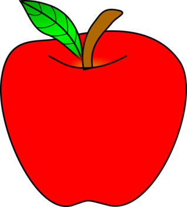

</Card>

<Card title="alligator" >

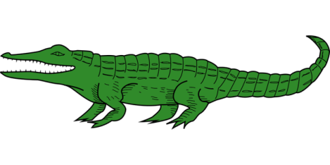

</Card>

<Card title="ax" >

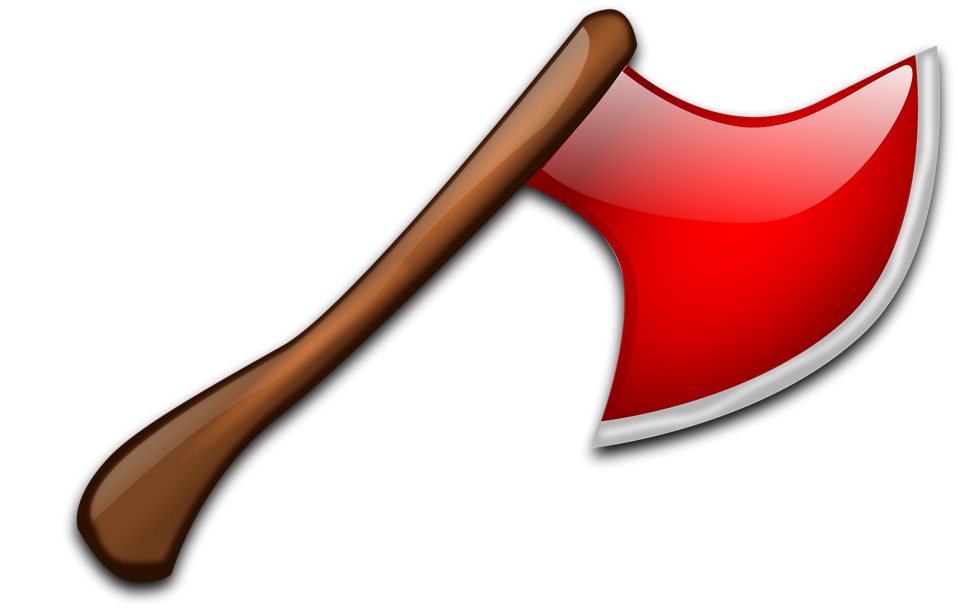

</Card>

</CardGrid>

## Bb

<CardGrid cols="4">

<Card title="bed" >

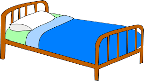

</Card>

<Card title="bear" >

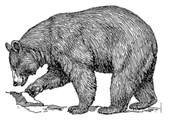

</Card>

<Card title="banana" >

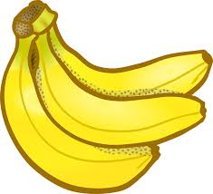

</Card>

<Card title="bird" >

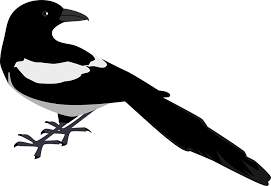

</Card>

</CardGrid>

## Cc

<CardGrid cols="4">

<Card title="cat" >

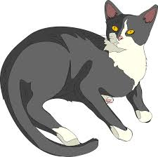

</Card>

<Card title="cup" >

</Card>

<Card title="computer" >

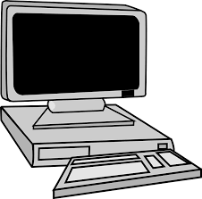

</Card>

<Card title="car" >

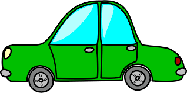

</Card>

</CardGrid>

## Dd

<CardGrid cols="4">

<Card title="doll" >

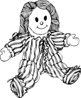

</Card>

<Card title="dog" >

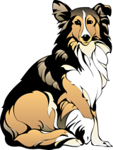

</Card>

<Card title="desk" >

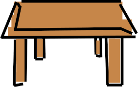

</Card>

<Card title="duck" >

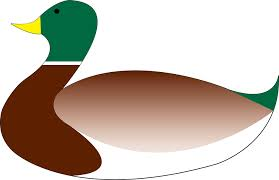

</Card>

</CardGrid>

## Ee

<CardGrid cols="4">

<Card title="egg" >

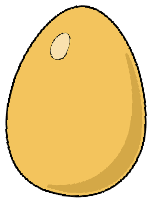

</Card>

<Card title="envelop" >

</Card>

<Card title="elbow" >

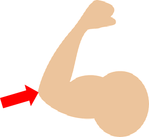

</Card>

<Card title="elephant" >

</Card>

</CardGrid>

## Ff

<CardGrid cols="4">

<Card title="farm" >

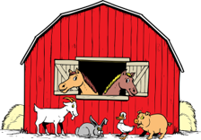

</Card>

<Card title="fan" >

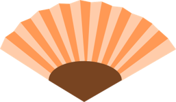

</Card>

<Card title="fork" >

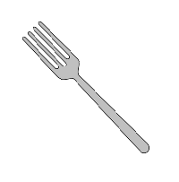

</Card>

<Card title="fish" >

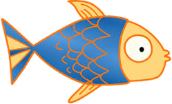

</Card>

</CardGrid>

## Gg

<CardGrid cols="4">

<Card title="gorilla" >

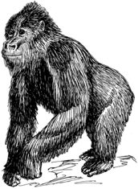

</Card>

<Card title="girl" >

</Card>

<Card title="gift" >

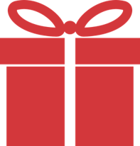

</Card>

<Card title="goat" >

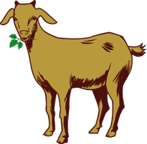

</Card>

</CardGrid>

## Hh

<CardGrid cols="4">

<Card title="hat" >

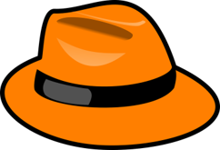

</Card>

<Card title="house" >

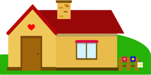

</Card>

<Card title="hot dog" >

</Card>

<Card title="horse" >

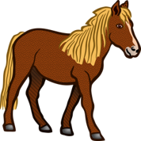

</Card>

</CardGrid>

## Ii

<CardGrid cols="4">

<Card title="igloo" >

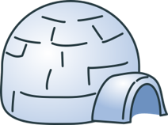

</Card>

<Card title="insect" >

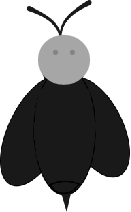

</Card>

<Card title="iguana" >

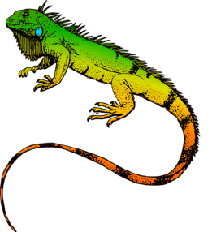

</Card>

<Card title="ink" >

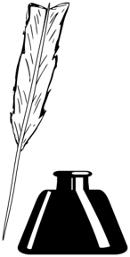

</Card>

</CardGrid>

## Jj

<CardGrid cols="4">

<Card title="juice" >

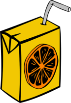

</Card>

<Card title="jacket" >

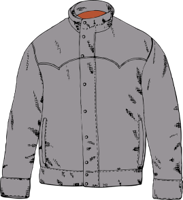

</Card>

<Card title="jam" >

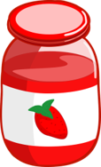

</Card>

<Card title="jet" >

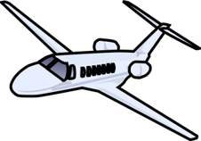

</Card>

</CardGrid>

## Kk

<CardGrid cols="4">

<Card title="key" >

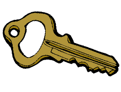

</Card>

<Card title="kite" >

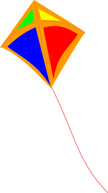

</Card>

<Card title="king" >

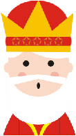

</Card>

<Card title="kangaroo" >

</Card>

</CardGrid>

## Ll

<CardGrid cols="4">

<Card title="lemon" >

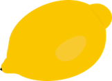

</Card>

<Card title="lamp" >

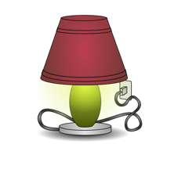

</Card>

<Card title="leaf" >

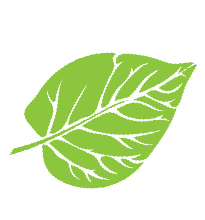

</Card>

<Card title="lion" >

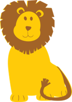

</Card>

</CardGrid>

## Mm

<CardGrid cols="4">

<Card title="mouse" >

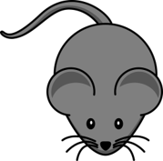

</Card>

<Card title="money" >

</Card>

<Card title="milk" >

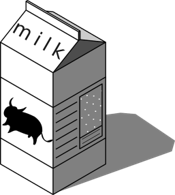

</Card>

<Card title="monkey" >

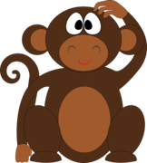

</Card>

</CardGrid>

## Nn

<CardGrid cols="4">

<Card title="nest" >

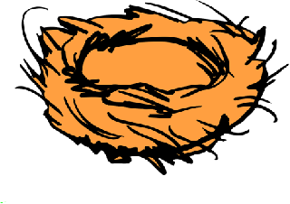

</Card>

<Card title="nose" >

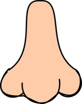

</Card>

<Card title="nut" >

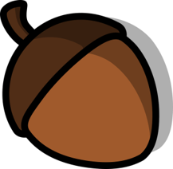

</Card>

<Card title="net" >

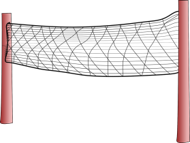

</Card>

</CardGrid>

## Oo

<CardGrid cols="4">

<Card title="ostrich" >

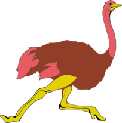

</Card>

<Card title="octopus" >

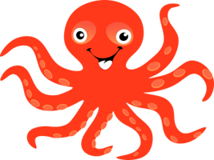

</Card>

<Card title="olive" >

</Card>

<Card title="ox" >

</Card>

</CardGrid>

## Pp

<CardGrid cols="4">

<Card title="panda" >

</Card>

<Card title="pineapple" >

</Card>

<Card title="peach" >

</Card>

<Card title="pen" >

</Card>

</CardGrid>

## Qq

<CardGrid cols="4">

<Card title="quilt" >

</Card>

<Card title="question" >

</Card>

<Card title="quiz" >

</Card>

<Card title="queen" >

</Card>

</CardGrid>

## Rr

<CardGrid cols="4">

<Card title="rice" >

</Card>

<Card title="rose" >

</Card>

<Card title="rabbit" >

</Card>

<Card title="robot" >

</Card>

</CardGrid>

## Ss

<CardGrid cols="4">

<Card title="soap" >

</Card>

<Card title="sun" >

</Card>

<Card title="socks" >

</Card>

<Card title="seal" >

</Card>

</CardGrid>

## Tt

<CardGrid cols="4">

<Card title="turtle" >

</Card>

<Card title="tent" >

</Card>

<Card title="teacher" >

</Card>

<Card title="tiger" >

</Card>

</CardGrid>

## Uu

<CardGrid cols="4">

<Card title="umpire" >

</Card>

<Card title="uncle" >

</Card>

<Card title="umbrella" >

</Card>

<Card title="up" >

</Card>

</CardGrid>

## Vv

<CardGrid cols="4">

<Card title="van" >

</Card>

<Card title="vest" >

</Card>

<Card title="vet" >

</Card>

<Card title="violin" >

</Card>

</CardGrid>

## Ww

<CardGrid cols="4">

<Card title="wet" >

</Card>

<Card title="watch" >

</Card>

<Card title="water" >

</Card>

<Card title="wolf" >

</Card>

</CardGrid>

## Xx

<CardGrid cols="4">

<Card title="box" >

</Card>

<Card title="wax" >

</Card>

<Card title="fox" >

</Card>

<Card title="six" >

</Card>

</CardGrid>

## Yy

<CardGrid cols="4">

<Card title="yoyo" >

</Card>

<Card title="yak" >

</Card>

<Card title="yogurt" >

</Card>

<Card title="yacht" >

</Card>

</CardGrid>

## Zz

<CardGrid cols="4">

<Card title="zibra" >

</Card>

<Card title="zoo" >

</Card>

<Card title="zero" >

</Card>

<Card title="zipper" >

</Card>

</CardGrid>
