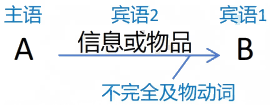

## 主语 + 双及物动词 + 宾语 + 宾语

> She gave me a gift. 她给了我一个礼物。

双及物动词：可以加两个宾语的动词。

此类动词一般都是向某个目标传递信息或物品。

常构成搭配：动词 + sb. + sth. （= 动词 + sth. + to sb.）

例如： give sb. sth. = give sth. to sb.

常见的双及物动词：give, bring, offer, pass, lend, buy, sell, tell, show, teach, ask