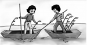
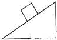

八年级下册主要围绕力学开展，涉及物理量：

| 物理量 | 符号 | 基本单位      | 含义                     |
| ------ | ---- | ------------- | ------------------------ |
| 力     | F    | N（牛）       | 物体对物体的作用         |
| 压强   | P    | Pa （帕斯卡） | 压力的作用效果           |
| 功     | W    | J （焦耳）    | 力在里的方向上移动的距离 |
| 功率   | P    | W （瓦特）    | 做功的快慢               |

## 一、力

### 1. 力

::: card title="力"

- 定义：物体对物体的作用
- 符号：F
- 单位：N（牛）
- 分类：弹力、拉力、压力、支持力、重力、浮力等

:::

力的相关知识：
1. ==施力物体和受力物体同时、成对出现==
2. 力的作用效果：
  - ==改变物体的形状==（使物体发生形变）
  - ==改变物体的运动状态==（改变运动的速度、方向等）
3. ==力的作用是相互的==（相互作用力）：
  - 相互作用的两个力互为==作用力==和==反作用力==
  - 特点：==大小相等、方向相反、在同一直线上，但作用在两个物体上==
4. 力的三要素：==大小、方向、作用点==

***
【例题】
1. 以下关于力的概念中，不正确的是？(   )
  - A. 力不可以脱离物体而独立存在
  - B. 力是物体与物体之间的相互作用
  - C. 不接触的物体间可能有力的作用
  - D. 相互接触的物体间一定有力的作用

2. 如图所示，右边小船上的人用力撑开左边那一只小船，结果两只小船将向\_\_\_\_\_\_（相同/相反）方向移动，这说明力的作用是\_\_\_\_\_\_的。

3. 修理汽车的工人师傅使用短套筒的六角扳手拧螺母时,发现很难拧开,于是换用长套筒的六角扳手来拧,这是通过改变如下哪个因素来拧开螺母的(  )
  - A. 力的大小
  - B. 力的方向
  - C. 力的作用点
  - D. 用力的时间

4. 用100N的力沿着斜面向上拉重为220N的物体，请在图中画出重力的示意图．

### 2. 弹力

### 3. 重力

## 二、运动和力

### 1. 牛顿第一定律

### 2. 二力平衡

### 3. 摩擦力

## 三、压强

### 1. 固体压强

### 2. 液体压强

### 3. 大气压强

### 4. 流体压强与流速的关系

## 四、浮力

### 1. 浮力

### 2. 阿基米德原理

### 3. 物体的浮沉

## 五、功和机械能

### 1. 功

### 2. 功率

### 3. 动能和势能

### 4. 机械能及其转化

## 六、简单机械

### 1. 杠杆

### 2. 滑轮

### 3. 机械效率
