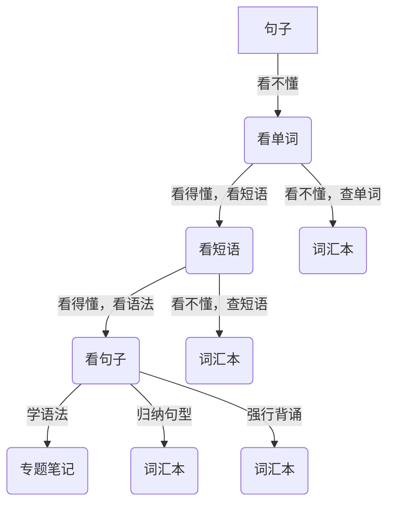

学会记录和管理自己的笔记很重要。

## 一、笔记的分类

我们可以将笔记分为三类：

1. 随记（随便记的，还没处理）
2. 笔记（整理过的，随时翻阅）
3. 数据（试卷、错题、单词表等）

### 1. 随记

感觉有用的信息，随时记下来，叫随记。

这种信息一般都是临时的，课堂灵感、阅读摘录、解题时的顿悟、考试后的反思等碎片化的思考。

这些碎片化的思考，需要我们进一步删除，删减，增加，整理，才能纳入到我们的知识体系当中。

### 2. 笔记

笔记是整理过的，专题性的，结构化的，成体系的。

笔记一般都有一个主题。假如我们想要研究某个问题，为这个问题专门去整理信息，放到一起，那么这个整理好的信息就是笔记。

例如，要提高作文的造句技能，提高作文的语法丰富度，我们可以整理一些 `重点句型` 。学习语法的时候，可能有 `时态` 的笔记。

### 3. 数据

做过的试卷，练习题，错题本，单词表，短语表等等，都算是数据。

这些数据里面，有已掌握的、学习中的、未掌握的、待复习的、重点的、非重点的、正确的、错误的等各种信息。想要快速翻阅，一般都要简单整理。

### 什么叫会记笔记？

很多学生的笔记本都是 `随记` ，老师让记就记，记完之后几乎没有再翻阅过，等于是无效笔记。做过的试卷、练习也是东一个西一个。背单词也是背过的、没背的，一股脑放在一起背、一起复习。

简单来说，很多学生几乎没有 `笔记` ，只有 `随记` 和 `数据` ，所以学习的过程中几乎没有自己的思考，那么学习是很难进步的。

## 二、笔记本的结构建议

笔记本可以设计这样的结构：

::: file-tree icon="colored"

- **笔记本** (专门研究的主题)
  - 考前笔记 (考前要复习或注意的内容)
  - 专题笔记 (语法点、题型总结等)
    - 例：判断词性的方法
    - 例：时态
    - 例：句型
    - 例：词根词缀
    - 例：名词的单复数和所有格
  - **词汇表** (平时需要复习的表达，可以混记)
    - 单词 (中-->英)
    - 单词 (英-->中)
    - 短语 (中-->英)
    - 句型 (中-->英)
    - 句子 (英-->中)
- **随记本** (随意记录的信息)
- **文件夹** (试卷、复习资料)

:::

## 三、加一点笔记

### 1. 考前笔记

考前笔记专门用来放考前要复习或注意的内容。每次考试之前都要看一眼。内容不需要很多，一到两张纸即可。

以下是部分考前笔记的思路：

1. 有哪些单词经常出现，但是还没背出来的（挑 20-50 个）
2. 有哪些自己容易搞混的单词和短语搭配？比如：
   - ex- 开头的单词
   - con- 开头的单词
   - bored, board, broad, abroad, aboard
3. 有哪些能用在作文的模板、句型？比如：
   - In my opinion, ... 在我看来...
   - It's + adj. + for sb. + to do sth.
4. 有哪些常考的语法点还不太熟？比如：
   - 常见的名词后缀
   - 各个时态的构成、含义、标志词
   - 常见的不可数名词
   - 主将从现
   - 主谓一致
5. 有哪些题型做的不太好，应该注意什么，检查什么？
   - 选词填空：有哪些判断词性的方法？
   - 完形填空：排除法+代入法，划关键词
6. ...

### 2. 专题笔记

专题笔记是针对某个主题的笔记，比如语法、题型、词根词缀、时态、句型等等。

现在试着做一个时态的笔记吧：

1. 初中有哪些时态？学过哪些？
2. 这些时态是怎么构成的？谓语动词怎么变化？
3. 这些时态的含义是什么？
4. 每个时态常见的标志词有哪些？
5. 如果选择题考时态，应该怎么做？有什么思路？
6. 为每个时态找一个例句。
7. 找几道时态题作为例题

在制作过程中，多用思维导图、表格、各种符号来帮助自己理解，尽量避免直接抄写别人的笔记。

### 3. 词汇表

词汇表是用来放所有自己不太熟，需要记忆的单词、短语、搭配、句型、句子的。每天复习，在背出来后可以删除。

将每页纸分为左右两部分：

1. 需要认，不用写的单词：左边英文，右边中文
2. 需要写的单词：左边中文，右边英文
3. 短语、搭配：左边中文，右边英文
4. 看不懂的的句子：左边英文，右边中文

#### Tip：看不懂的句子，如何订正

### 4. 随记本

随记本讲究随意，没有限制，和草稿纸类似。
